# 🚛 FleetFlow — Master Execution Blueprint

> **Modular Fleet & Logistics Management System**
> Odoo Hackathon 2026 · 6-Hour Sprint · Team of 4

---

## Table of Contents

1. [System Overview & Philosophy](#1-system-overview--philosophy)
2. [Actor Model & Use Case Diagrams](#2-actor-model--use-case-diagrams)
3. [Complete User Journey Maps](#3-complete-user-journey-maps)
4. [State Machine Diagrams](#4-state-machine-diagrams)
5. [Entity Relationship Diagram](#5-entity-relationship-diagram)
6. [Page-by-Page Detailed Specification](#6-page-by-page-detailed-specification)
7. [API Contract Map](#7-api-contract-map)
8. [Business Rule Engine](#8-business-rule-engine)
9. [Data Flow Architecture](#9-data-flow-architecture)
10. [Frontend Component Tree](#10-frontend-component-tree)
11. [Backend Module Architecture](#11-backend-module-architecture)
12. [Phase-Wise Execution Timeline](#12-phase-wise-execution-timeline)
13. [Demo Script & Critical Path](#13-demo-script--critical-path)
14. [Risk Matrix & Fallback Plans](#14-risk-matrix--fallback-plans)

---

## 1. System Overview & Philosophy

### What FleetFlow Solves

```
BEFORE FleetFlow:                          AFTER FleetFlow:
┌─────────────────────────┐                ┌─────────────────────────┐
│ ❌ Paper logbooks        │                │ ✅ Digital trip records   │
│ ❌ Excel spreadsheets    │                │ ✅ Automated state mgmt  │
│ ❌ No capacity checks    │     ──►        │ ✅ Rule-based validation  │
│ ❌ Manual status tracking│                │ ✅ Real-time dashboards  │
│ ❌ No audit trail        │                │ ✅ Immutable audit logs  │
│ ❌ Guesswork analytics   │                │ ✅ Computed KPIs & ROI   │
└─────────────────────────┘                └─────────────────────────┘
```

### Architectural Pattern: Modular Monolith

```
┌──────────────────────────────────────────────────────────────────┐
│                         REACT SPA (Vite)                         │
│  ┌──────────┬───────────┬──────────┬───────────┬──────────────┐  │
│  │Dashboard │ Vehicle   │ Trip     │ Mainten.  │  Analytics   │  │
│  │  Page    │ Registry  │Dispatch  │ & Service │  & Reports   │  │
│  └────┬─────┴─────┬─────┴────┬─────┴─────┬─────┴──────┬───────┘  │
│       │  Axios    │  HTTP    │   REST    │   JSON     │           │
└───────┼───────────┼─────────┼───────────┼────────────┼───────────┘
        │           │         │           │            │
┌───────▼───────────▼─────────▼───────────▼────────────▼───────────┐
│                    EXPRESS.JS API GATEWAY                         │
│  ┌─────────────────────────────────────────────────────────────┐  │
│  │  JWT Auth Middleware → RBAC → Zod Validation → Rate Limit  │  │
│  └─────────────────────────────────────────────────────────────┘  │
│                                                                   │
│  ┌─────────────┬──────────────┬──────────────┬────────────────┐  │
│  │  DISPATCH   │   FLEET      │     HR       │   FINANCE      │  │
│  │  MODULE     │   MODULE     │   MODULE     │   MODULE       │  │
│  │             │              │              │                │  │
│  │ TripService │VehicleService│DriverService │ ExpenseService │  │
│  │ TripRoutes  │VehicleRoutes │DriverRoutes  │ FuelLogService │  │
│  │ TripValid.  │VehicleValid. │DriverValid.  │ RevenueService │  │
│  └──────┬──────┴──────┬───────┴──────┬───────┴────────┬───────┘  │
│         │             │              │                │           │
│  ┌──────▼─────────────▼──────────────▼────────────────▼───────┐  │
│  │              PRISMA ORM (Data Access Layer)                 │  │
│  └─────────────────────────┬───────────────────────────────────┘  │
└────────────────────────────┼─────────────────────────────────────┘
                             │
┌────────────────────────────▼─────────────────────────────────────┐
│                     POSTGRESQL 16                                 │
│  ┌────────┬────────┬────────┬────────┬──────────┬─────────────┐  │
│  │ users  │vehicles│drivers │ trips  │fuel_logs │service_logs │  │
│  ├────────┼────────┼────────┼────────┼──────────┼─────────────┤  │
│  │expenses│revenues│  roles │audit_  │ INDEXES  │ CONSTRAINTS │  │
│  │        │        │        │  logs  │          │             │  │
│  └────────┴────────┴────────┴────────┴──────────┴─────────────┘  │
└──────────────────────────────────────────────────────────────────┘
```

---

## 2. Actor Model & Use Case Diagrams

### 2.1 System Actors

```
┌─────────────────────────────────────────────────────────────────┐
│                        FLEETFLOW ACTORS                         │
├─────────────────────────────────────────────────────────────────┤
│                                                                 │
│  👤 FLEET MANAGER (ADMIN)                                       │
│  ├── Full system access                                         │
│  ├── Vehicle lifecycle management (add/retire)                  │
│  ├── Driver onboarding & suspension                             │
│  ├── Dashboard & analytics overview                             │
│  └── Financial report generation                                │
│                                                                 │
│  👤 DISPATCHER                                                  │
│  ├── Trip creation & dispatch                                   │
│  ├── Vehicle/Driver assignment                                  │
│  ├── Trip completion & cancellation                             │
│  └── Fuel & expense logging                                     │
│                                                                 │
│  👤 SAFETY OFFICER                                              │
│  ├── Driver compliance monitoring                               │
│  ├── License expiry tracking                                    │
│  ├── Safety score management                                    │
│  └── Maintenance ticket creation                                │
│                                                                 │
│  👤 FINANCIAL ANALYST                                           │
│  ├── Expense auditing                                           │
│  ├── Revenue tracking                                           │
│  ├── ROI & cost-per-km reports                                  │
│  └── CSV/PDF export                                             │
│                                                                 │
└─────────────────────────────────────────────────────────────────┘
```

### 2.2 Use Case Diagram (Mermaid)

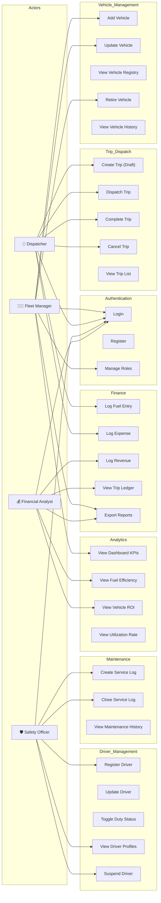

### 2.3 Use Cases — Detailed Descriptions

| # | Use Case | Actor(s) | Precondition | Postcondition | Validation Rules |
|---|----------|----------|-------------|---------------|-----------------|
| UC1 | Login | All | Has valid credentials | JWT token issued, role loaded | Email format, password ≥ 6 chars |
| UC2 | Register | Admin | Admin is logged in | New user created with role | Unique email, valid role enum |
| UC4 | Add Vehicle | Fleet Manager | Logged in as ADMIN | Vehicle in AVAILABLE status | Unique plate, capacity > 0 |
| UC9 | Create Trip | Dispatcher | Vehicle AVAILABLE, Driver ON_DUTY | Trip in DRAFT status | CargoWeight ≤ Vehicle capacity |
| UC10 | Dispatch Trip | Dispatcher | Trip is DRAFT | Trip DISPATCHED, Vehicle ON_TRIP, Driver ON_TRIP | License valid, vehicle available |
| UC11 | Complete Trip | Dispatcher | Trip is DISPATCHED | Trip COMPLETED, Vehicle AVAILABLE, Driver ON_DUTY | distanceActual required |
| UC19 | Create Service Log | Safety Officer | Vehicle exists | Vehicle → IN_SHOP | cost ≥ 0 |
| UC22 | Log Fuel | Dispatcher | Trip exists | FuelLog created | liters > 0, cost > 0, odometer ≥ current |

---

## 3. Complete User Journey Maps

### 3.1 Master Journey — Happy Path (End-to-End Demo Flow)

```mermaid
graph TD
    START([🏁 User Opens FleetFlow]) --> LOGIN[Login Page]
    LOGIN -->|Valid credentials| DASH[Command Center Dashboard]
    
    DASH --> V_REG[Vehicle Registry]
    V_REG -->|Click '+ New Vehicle'| V_FORM[Vehicle Registration Form]
    V_FORM -->|Fill: Plate, Model, Capacity| V_SAVE[Save Vehicle]
    V_SAVE -->|Status: AVAILABLE| V_LIST[Vehicle appears in registry]
    
    V_LIST --> D_REG[Driver Performance Page]
    D_REG -->|Click '+ New Driver'| D_FORM[Driver Registration Form]
    D_FORM -->|Fill: Name, License, Expiry| D_SAVE[Save Driver]
    D_SAVE -->|Status: OFF_DUTY| D_CLOCK[Driver Clocks In]
    D_CLOCK -->|Status: ON_DUTY| D_READY[Driver ready for dispatch]
    
    D_READY --> TRIP_PAGE[Trip Dispatcher Page]
    TRIP_PAGE -->|Click '+ New Trip'| T_FORM[Trip Creation Form]
    T_FORM -->|Select Vehicle dropdown| T_VEH[Only AVAILABLE vehicles shown]
    T_FORM -->|Select Driver dropdown| T_DRV[Only ON_DUTY + valid license shown]
    T_FORM -->|Enter cargo weight| T_CHECK{Cargo ≤ Capacity?}
    T_CHECK -->|No| T_ERR[❌ Error: Exceeds capacity]
    T_CHECK -->|Yes| T_DRAFT[Trip saved as DRAFT]
    
    T_DRAFT -->|Click 'Dispatch'| T_VALIDATE{Pre-flight checks}
    T_VALIDATE -->|Vehicle still AVAILABLE?| T_V_OK[✅ Pass]
    T_VALIDATE -->|Driver still ON_DUTY?| T_D_OK[✅ Pass]
    T_VALIDATE -->|License valid?| T_L_OK[✅ Pass]
    T_V_OK & T_D_OK & T_L_OK --> T_DISPATCH[Trip → DISPATCHED]
    T_DISPATCH --> T_SIDE_FX["Side Effects:<br/>Vehicle → ON_TRIP<br/>Driver → ON_TRIP"]
    
    T_SIDE_FX --> FUEL_PAGE[Expense & Fuel Page]
    FUEL_PAGE -->|Click 'Add Fuel Log'| F_FORM[Fuel Log Form]
    F_FORM -->|Liters, Cost/L, Odometer| F_SAVE[Fuel Log Saved]
    F_SAVE --> F_CALC[Total Cost auto-calculated]
    
    FUEL_PAGE -->|Click 'Add Expense'| E_FORM[Expense Form]
    E_FORM -->|Category, Amount| E_SAVE[Expense Saved]
    
    E_SAVE --> COMPLETE[Driver marks trip 'Complete']
    COMPLETE -->|Enter actual distance| T_COMPLETE[Trip → COMPLETED]
    T_COMPLETE --> T_FREE["Side Effects:<br/>Vehicle → AVAILABLE<br/>Driver → ON_DUTY"]
    
    T_FREE --> ANALYTICS[Analytics Page]
    ANALYTICS --> A_KPI["KPIs Updated:<br/>• Fuel Efficiency = dist/liters<br/>• Cost per KM<br/>• Fleet ROI"]
    
    A_KPI --> MAINT[Maintenance Page]
    MAINT -->|Create Service Log| M_FORM[Service Form]
    M_FORM -->|Vehicle + Issue + Cost| M_SAVE[Service Log Saved]
    M_SAVE --> M_SIDE["Side Effect:<br/>Vehicle → IN_SHOP<br/>Hidden from Dispatcher"]
    
    M_SIDE -->|Close Service Log| M_CLOSE[Service Completed]
    M_CLOSE --> M_FREE["Side Effect:<br/>Vehicle → AVAILABLE"]
    
    M_FREE --> DASH_FINAL[Dashboard reflects all changes]
    DASH_FINAL --> DONE([✅ Full Lifecycle Complete])
```

### 3.2 Authentication Journey

```mermaid
graph TD
    OPEN([User opens /login]) --> ROLE_VIEW[See Login form with role indicator]
    
    ROLE_VIEW --> FILL[Enter Email + Password]
    FILL --> VALIDATE_FE{Frontend Zod validation}
    VALIDATE_FE -->|Invalid| SHAKE[❌ Shake animation + field errors]
    SHAKE --> FILL
    
    VALIDATE_FE -->|Valid| SUBMIT[POST /api/v1/auth/login]
    SUBMIT --> PROGRESS[Progress bar: 60% → 85% → 90%]
    
    PROGRESS --> BE_CHECK{Backend validates}
    BE_CHECK -->|Email not found| ERR_404[❌ 'Invalid email or password']
    BE_CHECK -->|Wrong password| ERR_401[❌ 'Invalid email or password']
    BE_CHECK -->|Account disabled| ERR_403[❌ 'Account suspended']
    
    BE_CHECK -->|Success| JWT_ISSUE[Server issues JWT + returns role]
    JWT_ISSUE --> STORE[Store token in localStorage]
    STORE --> PROGRESS_100[Progress bar → 100%]
    PROGRESS_100 --> REDIRECT[Navigate to / Dashboard]
    
    ERR_404 & ERR_401 & ERR_403 --> CLEAR[Clear progress, show error toast]
    CLEAR --> FILL

    subgraph Registration Flow
        REG_LINK[Click 'Create Account'] --> REG_PAGE[/register page]
        REG_PAGE --> REG_FORM[Full Name, Email, Password, Confirm Password, Role Select]
        REG_FORM --> REG_ZOD{Zod validates all fields}
        REG_ZOD -->|Invalid| REG_ERR[Show field-level errors]
        REG_ZOD -->|Valid| REG_POST[POST /api/v1/auth/register]
        REG_POST -->|409 Conflict| DUP_EMAIL[❌ 'Email already exists']
        REG_POST -->|201 Created| REG_OK[✅ Success toast → redirect to /login]
    end
```

### 3.3 Trip Dispatch Journey — Detailed

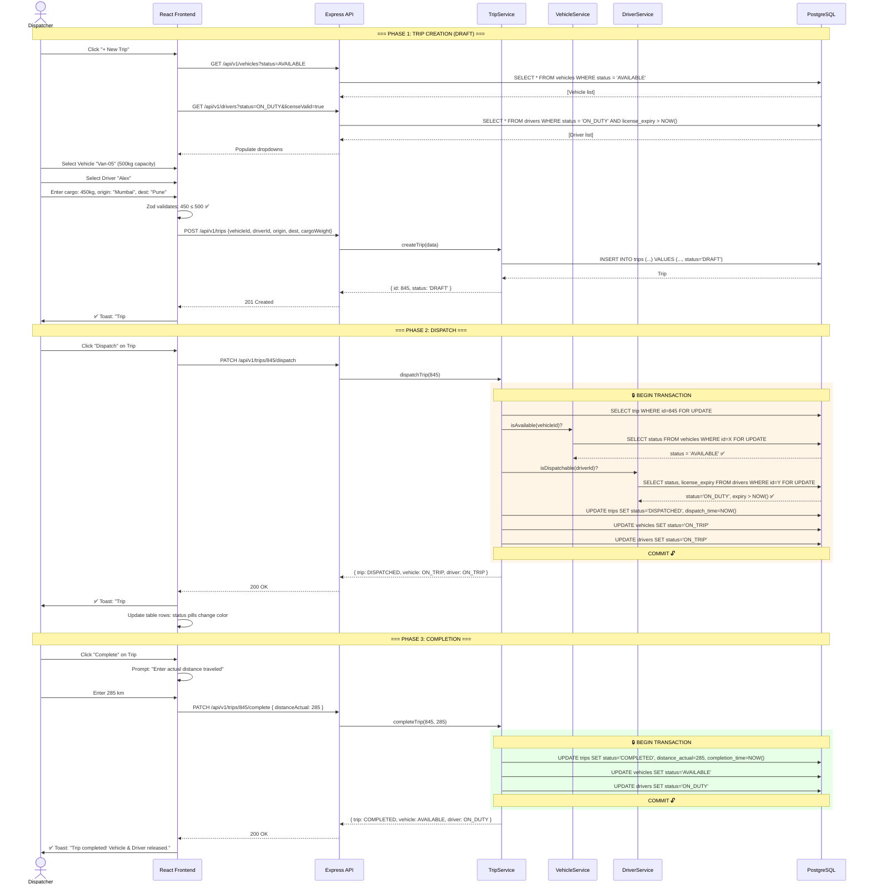

### 3.4 Maintenance Flow — Auto-Status Change

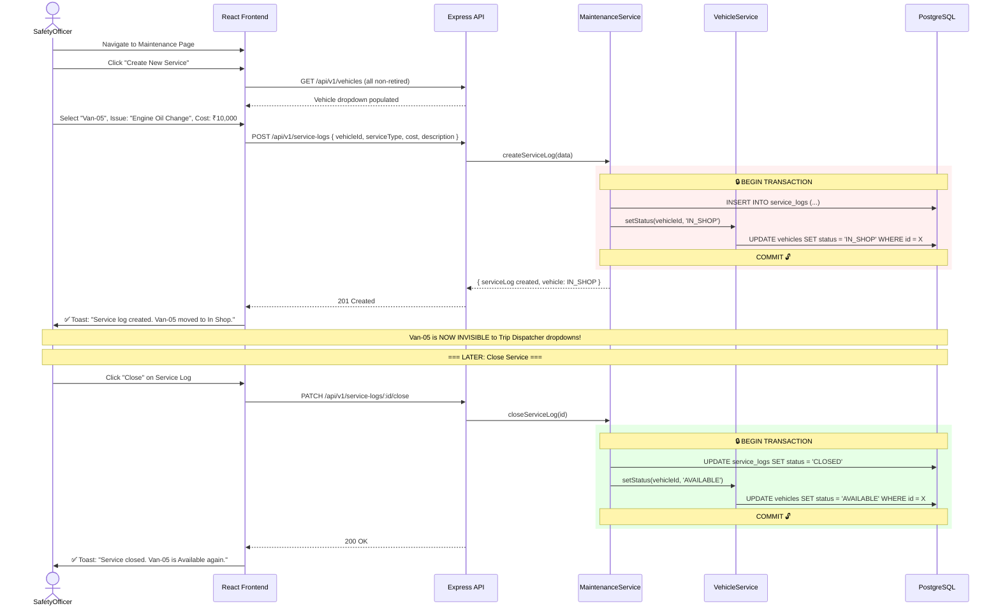

---

## 4. State Machine Diagrams

### 4.1 Vehicle State Machine

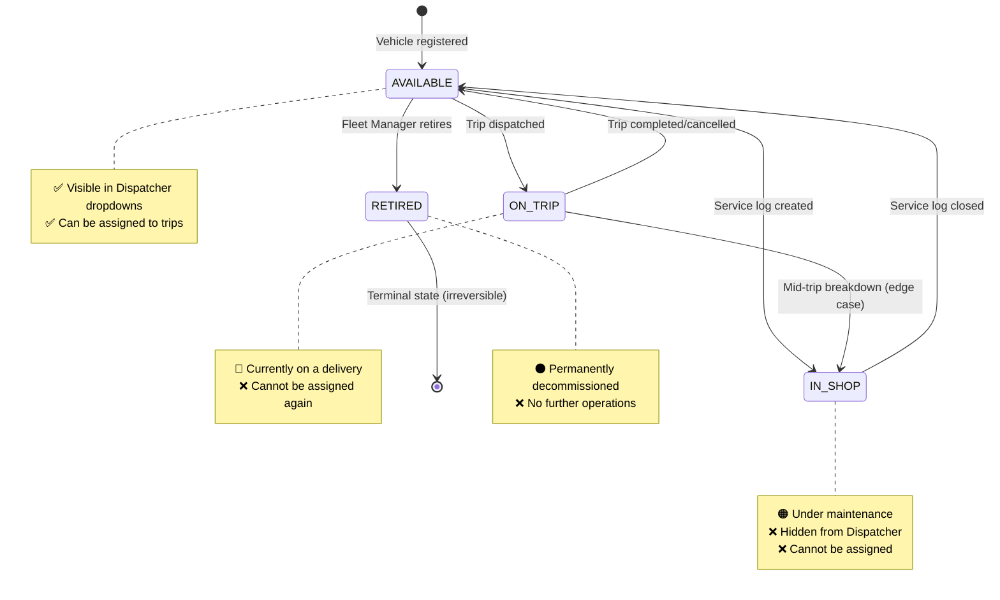

### 4.2 Driver State Machine

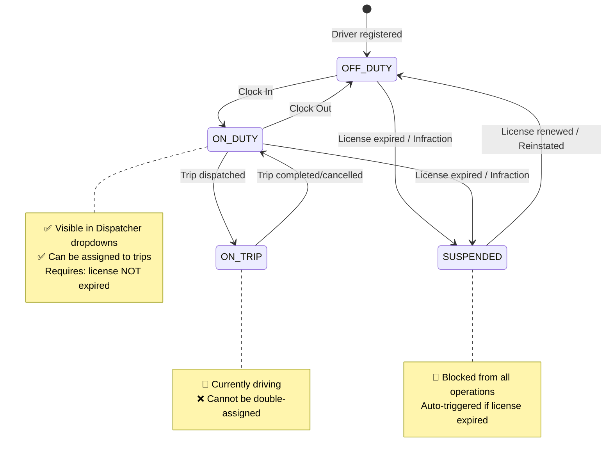

### 4.3 Trip State Machine

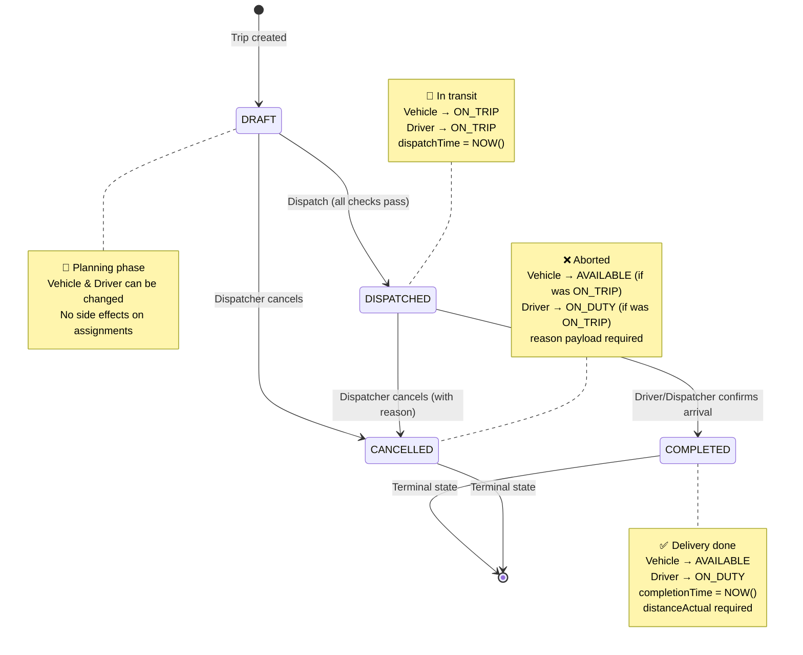

---

## 5. Entity Relationship Diagram

### 5.1 ER Diagram (Mermaid)

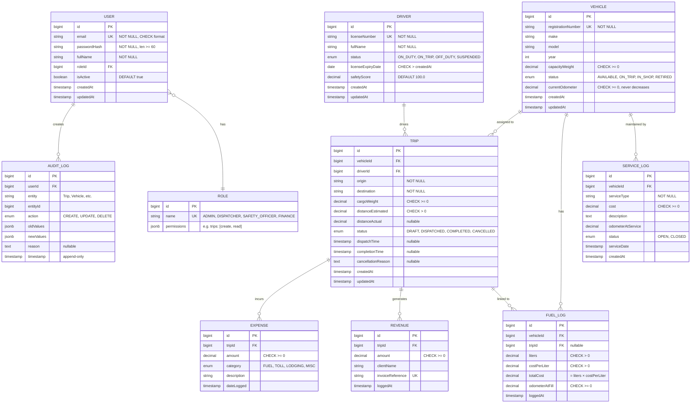

### 5.2 Index Strategy

| Table | Index | Type | Justification |
|-------|-------|------|---------------|
| `users` | `email` | B-Tree UNIQUE | Login lookups O(log n) |
| `vehicles` | `registrationNumber` | B-Tree UNIQUE | Plate uniqueness |
| `vehicles` | `status` | B-Tree | Filter AVAILABLE for dispatch dropdown |
| `drivers` | `licenseNumber` | B-Tree UNIQUE | License uniqueness |
| `drivers` | `status` WHERE `ON_DUTY` | Partial Index | Rapid dispatch-ready query |
| `trips` | `(vehicleId, status)` | Composite | Active trips per vehicle |
| `trips` | `(driverId, status)` | Composite | Active trips per driver |
| `trips` | `createdAt` | B-Tree | Sorted listing, pagination |
| `fuel_logs` | `vehicleId` | B-Tree | Per-vehicle fuel history |
| `expenses` | `tripId` | B-Tree | Trip ledger aggregation |

---

## 6. Page-by-Page Detailed Specification

### Page 1: Login & Authentication

```
┌──────────────────────────────────────────────────────────────────────┐
│                                                                      │
│  ┌───────────────────────┐  ┌──────────────────────────────────────┐ │
│  │                       │  │                                      │ │
│  │  GRADIENT LEFT PANEL  │  │    ○ (Logo)         [Role Badge]     │ │
│  │                       │  │                                      │ │
│  │  ○ FleetFlow Logo     │  │    Welcome back                     │ │
│  │                       │  │    Sign in to your account           │ │
│  │  "Manage your fleet.  │  │                                      │ │
│  │   Track every mile.   │  │    ┌────────────────────────────┐    │ │
│  │   Optimize every      │  │    │ 📧 Email                   │    │ │
│  │   dollar."            │  │    └────────────────────────────┘    │ │
│  │                       │  │    ┌────────────────────────────┐    │ │
│  │  ✅ Real-time fleet    │  │    │ 🔒 Password          [👁]  │    │ │
│  │     tracking          │  │    └────────────────────────────┘    │ │
│  │  ✅ Smart dispatch     │  │                                      │ │
│  │  ✅ Financial insights │  │    ☐ Remember me    Forgot Password? │ │
│  │  ✅ Safety compliance  │  │                                      │ │
│  │                       │  │    ┌────────────────────────────┐    │ │
│  │                       │  │    │      🔵 Sign In →          │    │ │
│  │                       │  │    └────────────────────────────┘    │ │
│  │  © 2026 FleetFlow     │  │                                      │ │
│  │                       │  │    Don't have an account? Register   │ │
│  └───────────────────────┘  └──────────────────────────────────────┘ │
│                                                                      │
└──────────────────────────────────────────────────────────────────────┘
```

**Page Spec:**
- **Route:** `/login`
- **Layout:** Split screen (52% gradient left panel / 48% form right)
- **Components:** Email input, Password input (with show/hide toggle), Remember me checkbox, Submit button with progress bar
- **Validation (Zod):** Email format + min 1, Password min 6 chars
- **UX:** Real-time field validation on blur, shake animation on error, progress bar during submit
- **API:** `POST /api/v1/auth/login` → returns JWT
- **On Success:** Store JWT in localStorage, redirect to `/`
- **Registration:** Link to `/register` page with: Full Name, Email, Password, Confirm Password, Role dropdown (Manager/Dispatcher/Safety/Finance)

---

### Page 2: Command Center (Main Dashboard)

```
┌──────────────────────────────────────────────────────────────────────────────────┐
│ ┌─[≡]──[🚛 FleetFlow]───────────[Search...]───[🔔]──[🌙]──[|]──[Avatar ▾]──┐  │
│ └────────────────────────────────────────────────────────────────────────────────┘ │
│                                                                                   │
│ ┌──────────┐                                                                      │
│ │ Sidebar  │  Home > Dashboard                                                    │
│ │          │                                                                      │
│ │Dashboard │  ┌───────────────────────────────────────────────────────────────┐   │
│ │Vehicle   │  │ 🚛 Command Center                    [+ New Trip] [+ Vehicle]│   │
│ │Registry  │  │ Real-time fleet operations overview                          │   │
│ │Trip      │  └───────────────────────────────────────────────────────────────┘   │
│ │Dispatch  │                                                                      │
│ │Mainten.  │  ┌──────────┐ ┌──────────┐ ┌──────────┐ ┌──────────┐               │
│ │Expenses  │  │🟢Active  │ │🟠Maint.  │ │📊Util.   │ │📦Pending │               │
│ │Drivers   │  │ Fleet    │ │ Alerts   │ │ Rate     │ │ Cargo    │               │
│ │Analytics │  │   220    │ │   180    │ │  82%     │ │   20     │               │
│ │          │  │ +5 today │ │ -2 today │ │ +3%      │ │ urgent   │               │
│ │          │  └──────────┘ └──────────┘ └──────────┘ └──────────┘               │
│ │          │                                                                      │
│ │          │  ┌─────────────────────────────────────┐ ┌─────────────────────┐     │
│ │          │  │ Recent Trips                        │ │ Quick Actions       │     │
│ │          │  │                                     │ │                     │     │
│ │          │  │ Trip│Vehicle │Driver │Status        │ │ 🚛 Register Vehicle │     │
│ │          │  │─────┼────────┼───────┼──────        │ │ 👤 Add Driver       │     │
│ │          │  │ #1  │Van-05  │Alex   │🟢 On Trip   │ │ 📋 Create Trip      │     │
│ │          │  │ #2  │Truck-3 │Jane   │✅ Done      │ │ 🔧 Log Service      │     │
│ │          │  │ #3  │Bike-7  │Sam    │📝 Draft     │ │                     │     │
│ │          │  │ #4  │Van-12  │—      │❌ Cancelled │ │ ⚠️ Expiring Licenses │     │
│ │          │  │                                     │ │ Alex - 15 days      │     │
│ │          │  │ [View All Trips →]                  │ │ Jane - 30 days      │     │
│ │          │  └─────────────────────────────────────┘ └─────────────────────┘     │
│ └──────────┘                                                                      │
└───────────────────────────────────────────────────────────────────────────────────┘
```

**Page Spec:**
- **Route:** `/` (index)
- **Layout:** `DashboardLayout` — stats row + 2-column body
- **KPI Cards (StatCard component):**
  - Active Fleet: `COUNT(vehicles WHERE status = 'ON_TRIP')`
  - Maintenance Alerts: `COUNT(vehicles WHERE status = 'IN_SHOP')`
  - Utilization Rate: `(ON_TRIP / (total - RETIRED)) × 100`
  - Pending Cargo: `COUNT(trips WHERE status = 'DRAFT')`
- **Recent Trips Table:** DataTable, 5 rows, status pills
- **Quick Actions:** Navigation buttons to key pages
- **Alerts Panel:** Drivers with licenses expiring in < 30 days
- **API Calls:**
  - `GET /api/v1/dashboard/stats`
  - `GET /api/v1/trips?limit=5&sort=createdAt:desc`
  - `GET /api/v1/drivers?licenseExpiringDays=30`

---

### Page 3: Vehicle Registry (Asset Management)

```
┌──────────────────────────────────────────────────────────────────────────────────┐
│ Sidebar │ Home > Vehicle Registry                                                │
│         │                                                                        │
│         │ ┌──────────────────────────────────────────────────────────────────┐   │
│         │ │ 🚛 Vehicle Registry                              [+ New Vehicle] │   │
│         │ │ Manage your fleet assets                                         │   │
│         │ └──────────────────────────────────────────────────────────────────┘   │
│         │                                                                        │
│         │ ┌─────────────────────┐ ┌──────────┐ ┌───────────┐ ┌──────────────┐   │
│         │ │ 🔍 Search vehicles  │ │Group By ▾│ │ Filter ▾  │ │  Sort By ▾   │   │
│         │ └─────────────────────┘ └──────────┘ └───────────┘ └──────────────┘   │
│         │                                                                        │
│         │ ┌──────────────────────────────────────────────────────────────────┐   │
│         │ │ # │ Plate     │ Model   │ Type │ Capacity │ Odometer │ Status │Act│  │
│         │ │───┼───────────┼─────────┼──────┼──────────┼──────────┼────────┼───│  │
│         │ │ 1 │ MH-02-AB  │ Tata Ace│ Mini │ 500 kg   │ 74,000   │🟢 Avail│ ⚙ │  │
│         │ │ 2 │ MH-04-CD  │ Eicher  │ Truck│ 5,000 kg │ 125,000  │🔵 Trip │ ⚙ │  │
│         │ │ 3 │ MH-01-EF  │ Mahindra│ Van  │ 1,200 kg │ 45,000   │🟠 Shop │ ⚙ │  │
│         │ │ 4 │ GJ-05-GH  │ Ashok L │ Truck│ 8,000 kg │ 200,000  │⚫ Ret'd│ — │  │
│         │ │ 5 │ MH-12-IJ  │ Tata LPT│ Heavy│ 16,000   │ 310,000  │🟢 Avail│ ⚙ │  │
│         │ │                                                                  │   │
│         │ │ Page 1 of 3   [← Prev]  [1] [2] [3]  [Next →]                   │   │
│         │ └──────────────────────────────────────────────────────────────────┘   │
│         │                                                                        │
│         │ ┌─ New Vehicle Form (Slide-over panel) ────────────────────────────┐   │
│         │ │                                                                  │   │
│         │ │  Registration Plate: [________________]                          │   │
│         │ │  Make:               [________________]                          │   │
│         │ │  Model:              [________________]                          │   │
│         │ │  Year:               [____]                                      │   │
│         │ │  Type:               [Truck ▾]                                   │   │
│         │ │  Max Capacity (kg):  [________________]                          │   │
│         │ │  Initial Odometer:   [________________]                          │   │
│         │ │                                                                  │   │
│         │ │  [🟢 Save Vehicle]  [Cancel]                                     │   │
│         │ └──────────────────────────────────────────────────────────────────┘   │
└──────────────────────────────────────────────────────────────────────────────────┘
```

**Page Spec:**
- **Route:** `/vehicles`
- **Layout:** `CrudLayout` — toolbar + DataTable + pagination
- **Columns:** #, Registration Plate, Model, Type, Capacity, Odometer, Status (pill), Actions (edit/retire)
- **Status Pills:**
  - 🟢 Available → `bg-emerald-100 text-emerald-700`
  - 🔵 On Trip → `bg-blue-100 text-blue-700`
  - 🟠 In Shop → `bg-amber-100 text-amber-700`
  - ⚫ Retired → `bg-slate-100 text-slate-500`
- **Filters:** By type (Truck/Van/Bike/Heavy), By status
- **Form Validation (Zod):**
  - `registrationNumber`: required, unique
  - `capacityWeight`: required, number > 0
  - `currentOdometer`: required, number ≥ 0
- **Actions per row:**
  - Edit → Opens pre-filled form
  - Retire → AlertDialog confirmation → PATCH status to RETIRED
- **API:**
  - `GET /api/v1/vehicles?status=&type=&page=1&limit=10`
  - `POST /api/v1/vehicles`
  - `PUT /api/v1/vehicles/:id`
  - `PATCH /api/v1/vehicles/:id/retire`

---

### Page 4: Trip Dispatcher & Management

```
┌──────────────────────────────────────────────────────────────────────────────────┐
│ Sidebar │ Home > Trip Dispatcher                                                 │
│         │                                                                        │
│         │ ┌──────────────────────────────────────────────────────────────────┐   │
│         │ │ 🚀 Trip Dispatcher                                 [+ New Trip]  │   │
│         │ │ Plan, dispatch, and track deliveries                             │   │
│         │ └──────────────────────────────────────────────────────────────────┘   │
│         │                                                                        │
│         │ ┌──────────────┐ ┌──────────┐ ┌──────────┐ ┌──────────┐              │
│         │ │ 📝 Drafts    │ │ 🚀 Active│ │ ✅ Done  │ │ ❌ Canc'd│              │
│         │ │     8        │ │    12    │ │    45    │ │     3    │              │
│         │ └──────────────┘ └──────────┘ └──────────┘ └──────────┘              │
│         │                                                                        │
│         │ ┌─────────────────────┐ ┌─────────┐ ┌───────────┐                    │
│         │ │ 🔍 Search trips...  │ │Filter ▾ │ │ Sort By ▾ │                    │
│         │ └─────────────────────┘ └─────────┘ └───────────┘                    │
│         │                                                                        │
│         │ ┌──────────────────────────────────────────────────────────────────┐   │
│         │ │ Trip│ Fleet Type│ Vehicle  │Driver │ Origin  │ Dest   │ Status  │Act│ │
│         │ │─────┼──────────┼──────────┼───────┼─────────┼────────┼─────────┼───│ │
│         │ │ #1  │Truck     │ MH-02-AB │ Alex  │ Mumbai  │ Pune   │📝 Draft │▶☒ │ │
│         │ │ #2  │Van       │ MH-04-CD │ Jane  │ Delhi   │ Jaipur │🚀 Active│✅☒│ │
│         │ │ #3  │Truck     │ MH-01-EF │ Sam   │ Chennai │ Bangalore│✅ Done │ — │ │
│         │ └──────────────────────────────────────────────────────────────────┘   │
│         │                                                                        │
│         │ ┌─ New Trip Form ──────────────────────────────────────────────────┐   │
│         │ │                                                                  │   │
│         │ │  Select Vehicle:    [▾ Only AVAILABLE vehicles shown]             │   │
│         │ │                     Selected: Van-05 (Capacity: 500 kg)           │   │
│         │ │                                                                  │   │
│         │ │  Select Driver:     [▾ Only ON_DUTY + valid license shown]        │   │
│         │ │                     Selected: Alex (License valid until 2027)     │   │
│         │ │                                                                  │   │
│         │ │  Cargo Weight (kg): [450_____]                                   │   │
│         │ │                     ✅ 450 ≤ 500 kg capacity — OK                │   │
│         │ │                                                                  │   │
│         │ │  Origin Address:    [Mumbai, MH___________________]              │   │
│         │ │  Destination:       [Pune, MH_____________________]              │   │
│         │ │  Est. Distance (km):[150_____]                                   │   │
│         │ │                                                                  │   │
│         │ │  [🟢 Save as Draft]  [🚀 Confirm & Dispatch]  [Cancel]           │   │
│         │ └──────────────────────────────────────────────────────────────────┘   │
└──────────────────────────────────────────────────────────────────────────────────┘
```

**Page Spec:**
- **Route:** `/trips`
- **Layout:** `CrudLayout` — status summary cards + toolbar + DataTable
- **Status Summary Cards:** Drafts / Active / Completed / Cancelled counts
- **Trip Status Pills:**
  - 📝 Draft → `bg-slate-100 text-slate-600`
  - 🚀 Dispatched → `bg-blue-100 text-blue-700`
  - ✅ Completed → `bg-emerald-100 text-emerald-700`
  - ❌ Cancelled → `bg-red-100 text-red-600`
- **Row Actions:**
  - Draft → [Dispatch ▶] [Cancel ☒]
  - Dispatched → [Complete ✅] [Cancel ☒]
  - Completed/Cancelled → No actions (terminal)
- **New Trip Form Logic:**
  1. Vehicle dropdown: `GET /api/v1/vehicles?status=AVAILABLE`
  2. Driver dropdown: `GET /api/v1/drivers?status=ON_DUTY&licenseValid=true`
  3. On vehicle select → show capacity badge
  4. On cargo weight change → instant validation: `cargoWeight ≤ vehicle.capacityWeight`
  5. If invalid → red border + error message "Cargo exceeds vehicle capacity (500 kg max)"
- **Capacity Validation Visual:**
  ```
  Cargo: 450 kg  │████████████████████░░░░│ 500 kg capacity
                  └── 90% utilized ─────────┘
  ```
- **API:**
  - `GET /api/v1/trips?status=&page=1&limit=10`
  - `POST /api/v1/trips` → creates DRAFT
  - `PATCH /api/v1/trips/:id/dispatch`
  - `PATCH /api/v1/trips/:id/complete` (body: `{ distanceActual }`)
  - `PATCH /api/v1/trips/:id/cancel` (body: `{ reason }`)

---

### Page 5: Maintenance & Service Logs

```
┌──────────────────────────────────────────────────────────────────────────────────┐
│ Sidebar │ Home > Maintenance                                                     │
│         │                                                                        │
│         │ ┌──────────────────────────────────────────────────────────────────┐   │
│         │ │ 🔧 Maintenance & Service Logs              [+ Create New Service]│   │
│         │ │ Track vehicle health and repairs                                 │   │
│         │ └──────────────────────────────────────────────────────────────────┘   │
│         │                                                                        │
│         │ ┌─────────────────────┐ ┌───────────┐ ┌───────────┐                   │
│         │ │ 🔍 Search logs...   │ │ Filter ▾  │ │ Sort By ▾ │                   │
│         │ └─────────────────────┘ └───────────┘ └───────────┘                   │
│         │                                                                        │
│         │ ┌──────────────────────────────────────────────────────────────────┐   │
│         │ │ Log ID │ Vehicle  │ Issue/Service    │ Date  │ Cost   │ Status  │   │
│         │ │────────┼──────────┼──────────────────┼───────┼────────┼─────────│   │
│         │ │  321   │ Tata Ace │ Engine Oil Change│ 20/02 │ ₹10,000│🟠 Open  │   │
│         │ │  320   │ Eicher   │ Brake Pad Replace│ 19/02 │ ₹15,000│✅ Closed │   │
│         │ │  319   │ Mahindra │ Tire Rotation    │ 18/02 │ ₹3,000 │✅ Closed │   │
│         │ └──────────────────────────────────────────────────────────────────┘   │
│         │                                                                        │
│         │ ┌─ New Service Form ───────────────────────────────────────────────┐   │
│         │ │                                                                  │   │
│         │ │  Vehicle:        [▾ Select vehicle (non-retired)]                │   │
│         │ │  Service Type:   [▾ Oil Change / Brake / Tire / Engine / Other]   │   │
│         │ │  Description:    [________________________________]              │   │
│         │ │  Cost (₹):       [________________]                              │   │
│         │ │  Service Date:   [📅 Date picker]                                │   │
│         │ │                                                                  │   │
│         │ │  ⚠️ Note: Creating this log will set the vehicle to "In Shop"    │   │
│         │ │  and remove it from the Dispatcher's available pool.             │   │
│         │ │                                                                  │   │
│         │ │  [🟢 Create Service Log]  [Cancel]                               │   │
│         │ └──────────────────────────────────────────────────────────────────┘   │
└──────────────────────────────────────────────────────────────────────────────────┘
```

**Page Spec:**
- **Route:** `/maintenance`
- **Layout:** `CrudLayout`
- **Key Rule:** Creating a service log **auto-sets** vehicle status to `IN_SHOP`
- **Closing a service log** auto-sets vehicle back to `AVAILABLE`
- **Warning banner** in form: "This will move the vehicle to In Shop"
- **Row Actions:**
  - Open → [Close Service] button
  - Closed → No actions
- **API:**
  - `GET /api/v1/service-logs?status=&page=1&limit=10`
  - `POST /api/v1/service-logs`
  - `PATCH /api/v1/service-logs/:id/close`

---

### Page 6: Expense & Fuel Logging

```
┌──────────────────────────────────────────────────────────────────────────────────┐
│ Sidebar │ Home > Trip & Expenses                                                 │
│         │                                                                        │
│         │ ┌──────────────────────────────────────────────────────────────────┐   │
│         │ │ 💰 Trip Expenses & Fuel Logs                  [+ Add Expense]    │   │
│         │ │ Track costs and fuel consumption per trip                         │   │
│         │ └──────────────────────────────────────────────────────────────────┘   │
│         │                                                                        │
│         │ ┌──────────────────────────────────────────────────────────────────┐   │
│         │ │Trip ID│Driver │Distance│Fuel Exp.│Misc Exp.│Total Cost│Status  │   │
│         │ │───────┼───────┼────────┼─────────┼─────────┼──────────┼────────│   │
│         │ │  321  │ Alex  │1000 km │ ₹14,000 │ ₹3,000  │ ₹17,000  │✅ Done │   │
│         │ │  320  │ Jane  │ 850 km │ ₹11,500 │ ₹1,200  │ ₹12,700  │✅ Done │   │
│         │ │  319  │ Sam   │ 400 km │  ₹5,600 │   ₹500  │  ₹6,100  │🚀 Active│  │
│         │ └──────────────────────────────────────────────────────────────────┘   │
│         │                                                                        │
│         │ ┌─ Add Expense Form ───────────────────────────────────────────────┐   │
│         │ │                                                                  │   │
│         │ │  Tab: [🛢️ Fuel Log]  [💳 Misc Expense]                           │   │
│         │ │                                                                  │   │
│         │ │  ── Fuel Log ──                    ── Misc Expense ──            │   │
│         │ │  Trip:    [▾ Select trip]           Trip:    [▾ Select trip]      │   │
│         │ │  Liters:  [________]               Category: [▾ Toll/Lodge/Misc] │   │
│         │ │  ₹/Liter: [________]               Amount:  [________]           │   │
│         │ │  Odometer: [________]              Description: [____________]    │   │
│         │ │  Total: ₹ auto-calculated                                        │   │
│         │ │                                                                  │   │
│         │ │  [🟢 Save]  [Cancel]                                             │   │
│         │ └──────────────────────────────────────────────────────────────────┘   │
└──────────────────────────────────────────────────────────────────────────────────┘
```

**Page Spec:**
- **Route:** `/expenses`
- **Layout:** `CrudLayout`
- **Two form modes (tabs):**
  1. **Fuel Log:** Trip, Liters, Cost/Liter, Odometer → `totalCost = liters × costPerLiter` (auto-calculated, read-only)
  2. **Misc Expense:** Trip, Category (TOLL/LODGING/MISC), Amount, Description
- **Table:** Aggregated view per trip (SUM fuel + SUM expenses = Total Cost)
- **Validation:**
  - Liters > 0, CostPerLiter > 0
  - Odometer ≥ vehicle's current odometer (prevents fraud)
  - Amount ≥ 0
- **API:**
  - `GET /api/v1/trips?status=DISPATCHED,COMPLETED` (for dropdown)
  - `POST /api/v1/fuel-logs`
  - `POST /api/v1/expenses`
  - `GET /api/v1/trips/:id/ledger` (aggregated costs)

---

### Page 7: Driver Performance & Safety Profiles

```
┌──────────────────────────────────────────────────────────────────────────────────┐
│ Sidebar │ Home > Drivers                                                         │
│         │                                                                        │
│         │ ┌──────────────────────────────────────────────────────────────────┐   │
│         │ │ 👤 Driver Performance & Safety                   [+ Add Driver]  │   │
│         │ │ Monitor compliance and performance                               │   │
│         │ └──────────────────────────────────────────────────────────────────┘   │
│         │                                                                        │
│         │ ┌──────────────────────────────────────────────────────────────────┐   │
│         │ │Name  │License# │Expiry │Completion│Safety │Status    │Actions   │   │
│         │ │──────┼─────────┼───────┼──────────┼───────┼──────────┼──────────│   │
│         │ │Alex  │ DL-2341 │🟢2027 │   92%    │ 89/100│🟢 On Duty│ ⚙        │   │
│         │ │Jane  │ DL-5678 │🟠2026 │   95%    │ 94/100│🔵 On Trip│ ⚙        │   │
│         │ │Sam   │ DL-9012 │🔴Exp'd│   88%    │ 75/100│🔴 Susp'd │ ⚙        │   │
│         │ │Ravi  │ DL-3456 │🟢2028 │   91%    │ 82/100│⚫ Off Duty│ ⚙        │   │
│         │ └──────────────────────────────────────────────────────────────────┘   │
│         │                                                                        │
│         │  License Expiry Visual Indicators:                                     │
│         │  🟢 > 90 days     🟠 30-90 days     🔴 < 30 days or expired            │
│         │                                                                        │
│         │ ┌─ Add Driver Form ────────────────────────────────────────────────┐   │
│         │ │  Full Name:          [________________]                           │   │
│         │ │  License Number:     [________________]                           │   │
│         │ │  License Category:   [▾ LMV / HMV / Both]                        │   │
│         │ │  License Expiry:     [📅 Date picker]                            │   │
│         │ │  Phone:              [________________]                           │   │
│         │ │                                                                  │   │
│         │ │  [🟢 Register Driver]  [Cancel]                                  │   │
│         │ └──────────────────────────────────────────────────────────────────┘   │
└──────────────────────────────────────────────────────────────────────────────────┘
```

**Page Spec:**
- **Route:** `/drivers`
- **Layout:** `CrudLayout`
- **Driver Status Pills:**
  - 🟢 On Duty → `bg-emerald-100 text-emerald-700`
  - 🔵 On Trip → `bg-blue-100 text-blue-700`
  - ⚫ Off Duty → `bg-slate-100 text-slate-500`
  - 🔴 Suspended → `bg-red-100 text-red-700`
- **License Expiry Color Logic:**
  - Green: > 90 days remaining
  - Amber: 30-90 days remaining
  - Red: < 30 days or already expired
- **Derived Fields:**
  - `completionRate = (COMPLETED trips / total assigned) × 100`
  - `safetyScore` = stored score (100 baseline, decremented by incidents)
- **Row Actions:**
  - Toggle duty: ON_DUTY ↔ OFF_DUTY
  - Suspend: Manual suspension by Safety Officer
  - Edit: Update driver details
- **API:**
  - `GET /api/v1/drivers?status=&page=1&limit=10`
  - `POST /api/v1/drivers`
  - `PUT /api/v1/drivers/:id`
  - `PATCH /api/v1/drivers/:id/status` (body: `{ status: 'ON_DUTY' | 'OFF_DUTY' | 'SUSPENDED' }`)

---

### Page 8: Operational Analytics & Financial Reports

```
┌──────────────────────────────────────────────────────────────────────────────────┐
│ Sidebar │ Home > Analytics                                                       │
│         │                                                                        │
│         │ ┌──────────────────────────────────────────────────────────────────┐   │
│         │ │ 📊 Operational Analytics & Reports            [📥 Export CSV]     │   │
│         │ │ Data-driven fleet decision making                                │   │
│         │ └──────────────────────────────────────────────────────────────────┘   │
│         │                                                                        │
│         │ ┌──────────┐ ┌──────────┐ ┌──────────┐                               │
│         │ │💰Total    │ │📈Fleet   │ │📊Util.   │                               │
│         │ │Fuel Cost  │ │  ROI     │ │  Rate    │                               │
│         │ │₹ 2.6 L    │ │ +12.5%  │ │  82%     │                               │
│         │ └──────────┘ └──────────┘ └──────────┘                               │
│         │                                                                        │
│         │ ┌──────────────────────────┐ ┌──────────────────────────┐             │
│         │ │ Fuel Efficiency Trend    │ │ Top 5 Costliest Vehicles │             │
│         │ │      (km/L)             │ │                          │             │
│         │ │  15┤                     │ │  ████████████  ₹85,000  │             │
│         │ │  12┤    ╱╲              │ │  ██████████    ₹72,000  │             │
│         │ │   9┤   ╱  ╲   ╱╲       │ │  ████████      ₹58,000  │             │
│         │ │   6┤  ╱    ╲ ╱  ╲      │ │  ██████        ₹45,000  │             │
│         │ │   3┤ ╱      ╲    ╲     │ │  ████          ₹31,000  │             │
│         │ │    └──┬──┬──┬──┬──      │ │                          │             │
│         │ │      Jan Feb Mar Apr    │ │  Van-05, Truck-3, etc.   │             │
│         │ └──────────────────────────┘ └──────────────────────────┘             │
│         │                                                                        │
│         │ ┌──────────────────────────────────────────────────────────────────┐   │
│         │ │ Financial Summary of Month                                       │   │
│         │ │                                                                  │   │
│         │ │ Month  │ Revenue  │ Fuel Cost │ Maintenance │ Net Profit        │   │
│         │ │────────┼──────────┼───────────┼─────────────┼───────────        │   │
│         │ │ Jan    │ ₹17L     │ ₹6L       │ ₹2L         │ ₹9L              │   │
│         │ │ Feb    │ ₹15L     │ ₹5.5L     │ ₹1.8L       │ ₹7.7L            │   │
│         │ └──────────────────────────────────────────────────────────────────┘   │
└──────────────────────────────────────────────────────────────────────────────────┘
```

**Page Spec:**
- **Route:** `/analytics`
- **Layout:** `DashboardLayout`
- **KPI Cards:**
  - Total Fuel Cost: `SUM(fuel_logs.totalCost)`
  - Fleet ROI: `((SUM(revenue) - SUM(costs)) / SUM(costs)) × 100`
  - Utilization Rate: `ON_TRIP vehicles / total active × 100`
- **Charts (using simple HTML/CSS bar charts or a lightweight lib):**
  - Fuel Efficiency Trend: km/L per month (line chart)
  - Top 5 Costliest Vehicles: horizontal bar chart
- **Financial Table:** Monthly breakdown: Revenue, Fuel, Maintenance, Net Profit
- **Export:** CSV download button
- **API:**
  - `GET /api/v1/analytics/fleet-summary`
  - `GET /api/v1/analytics/fuel-efficiency?period=monthly`
  - `GET /api/v1/analytics/costly-vehicles?limit=5`
  - `GET /api/v1/analytics/monthly-financial`

---

## 7. API Contract Map

### 7.1 Complete Route Table

| Method | Endpoint | Auth | Roles | Request Body | Response | Status |
|--------|----------|------|-------|-------------|----------|--------|
| **AUTH** | | | | | | |
| POST | `/api/v1/auth/register` | No | Public | `{ fullName, email, password, role }` | `{ user, token }` | 201 |
| POST | `/api/v1/auth/login` | No | Public | `{ email, password }` | `{ user, token }` | 200 |
| GET | `/api/v1/auth/me` | Yes | All | — | `{ user }` | 200 |
| **VEHICLES** | | | | | | |
| GET | `/api/v1/vehicles` | Yes | All | — | `{ data: Vehicle[], meta }` | 200 |
| GET | `/api/v1/vehicles/:id` | Yes | All | — | `{ data: Vehicle }` | 200 |
| POST | `/api/v1/vehicles` | Yes | ADMIN | `{ registrationNumber, make, model, year, capacityWeight, currentOdometer }` | `{ data: Vehicle }` | 201 |
| PUT | `/api/v1/vehicles/:id` | Yes | ADMIN | `{ make?, model?, year?, capacityWeight? }` | `{ data: Vehicle }` | 200 |
| PATCH | `/api/v1/vehicles/:id/retire` | Yes | ADMIN | — | `{ data: Vehicle }` | 200 |
| **DRIVERS** | | | | | | |
| GET | `/api/v1/drivers` | Yes | All | — | `{ data: Driver[], meta }` | 200 |
| GET | `/api/v1/drivers/:id` | Yes | All | — | `{ data: Driver }` | 200 |
| POST | `/api/v1/drivers` | Yes | ADMIN, SO | `{ fullName, licenseNumber, licenseExpiryDate }` | `{ data: Driver }` | 201 |
| PUT | `/api/v1/drivers/:id` | Yes | ADMIN, SO | `{ fullName?, licenseExpiryDate? }` | `{ data: Driver }` | 200 |
| PATCH | `/api/v1/drivers/:id/status` | Yes | ADMIN, SO | `{ status: ON_DUTY\|OFF_DUTY\|SUSPENDED }` | `{ data: Driver }` | 200 |
| **TRIPS** | | | | | | |
| GET | `/api/v1/trips` | Yes | All | — | `{ data: Trip[], meta }` | 200 |
| GET | `/api/v1/trips/:id` | Yes | All | — | `{ data: Trip }` | 200 |
| POST | `/api/v1/trips` | Yes | DISP | `{ vehicleId, driverId, origin, destination, cargoWeight, distanceEstimated }` | `{ data: Trip }` | 201 |
| PATCH | `/api/v1/trips/:id/dispatch` | Yes | DISP | — | `{ data: Trip }` | 200 |
| PATCH | `/api/v1/trips/:id/complete` | Yes | DISP | `{ distanceActual }` | `{ data: Trip }` | 200 |
| PATCH | `/api/v1/trips/:id/cancel` | Yes | DISP | `{ reason }` | `{ data: Trip }` | 200 |
| GET | `/api/v1/trips/:id/ledger` | Yes | All | — | `{ fuel, expenses, total }` | 200 |
| **FUEL LOGS** | | | | | | |
| POST | `/api/v1/fuel-logs` | Yes | DISP | `{ vehicleId, tripId?, liters, costPerLiter, odometerAtFill }` | `{ data: FuelLog }` | 201 |
| GET | `/api/v1/fuel-logs?vehicleId=` | Yes | All | — | `{ data: FuelLog[] }` | 200 |
| **SERVICE LOGS** | | | | | | |
| GET | `/api/v1/service-logs` | Yes | All | — | `{ data: ServiceLog[] }` | 200 |
| POST | `/api/v1/service-logs` | Yes | SO, ADMIN | `{ vehicleId, serviceType, cost, description }` | `{ data: ServiceLog }` | 201 |
| PATCH | `/api/v1/service-logs/:id/close` | Yes | SO, ADMIN | — | `{ data: ServiceLog }` | 200 |
| **EXPENSES** | | | | | | |
| POST | `/api/v1/expenses` | Yes | DISP, FIN | `{ tripId, category, amount, description }` | `{ data: Expense }` | 201 |
| GET | `/api/v1/expenses?tripId=` | Yes | All | — | `{ data: Expense[] }` | 200 |
| **ANALYTICS** | | | | | | |
| GET | `/api/v1/analytics/dashboard` | Yes | All | — | `{ activeFleet, inShop, utilRate, pendingCargo }` | 200 |
| GET | `/api/v1/analytics/fleet-summary` | Yes | ADMIN, FIN | — | `{ totalFuel, roi, utilRate }` | 200 |
| GET | `/api/v1/analytics/monthly-financial` | Yes | ADMIN, FIN | — | `{ months: [...] }` | 200 |

### 7.2 Standard Response Format

```json
// ✅ Success
{
  "success": true,
  "data": { ... },
  "meta": {
    "page": 1,
    "limit": 10,
    "total": 45,
    "messages": ["Trip dispatched successfully"]
  }
}

// ❌ Error
{
  "success": false,
  "error": {
    "code": "VALIDATION_ERROR",
    "message": "Cargo weight exceeds vehicle capacity",
    "details": [
      { "field": "cargoWeight", "message": "Must be ≤ 500 kg (vehicle capacity)" }
    ]
  }
}
```

---

## 8. Business Rule Engine

### 8.1 Validation Rules Matrix

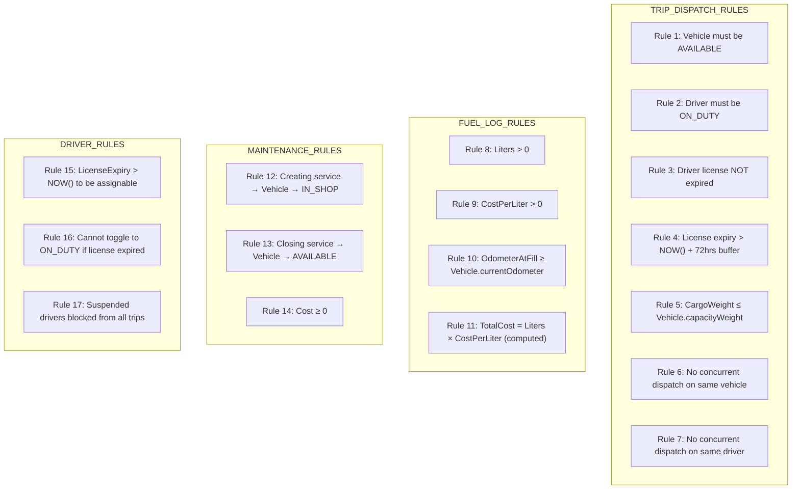

### 8.2 Error Code Reference

| Code | HTTP | When | UI Behavior |
|------|------|------|-------------|
| `VEHICLE_NOT_AVAILABLE` | 409 | Dispatch: vehicle isn't AVAILABLE | Red toast + disable dispatch button |
| `DRIVER_NOT_ON_DUTY` | 409 | Dispatch: driver isn't ON_DUTY | Red toast |
| `LICENSE_EXPIRED` | 422 | Dispatch: driver license expired | Red toast + highlight driver row |
| `CARGO_EXCEEDS_CAPACITY` | 422 | Create trip: cargo > capacity | Inline field error + progress bar |
| `CONCURRENT_DISPATCH` | 409 | Race condition: same vehicle dispatched twice | Red toast: "Vehicle already assigned" |
| `ODOMETER_REGRESSION` | 409 | Fuel log: odometer < current | Inline error: "Cannot go below current" |
| `DUPLICATE_EMAIL` | 409 | Register: email already exists | Inline field error |
| `INVALID_CREDENTIALS` | 401 | Login: wrong email/password | Form shake + error banner |
| `TRIP_NOT_DISPATCHABLE` | 422 | Dispatch: trip not in DRAFT | Red toast |
| `SERVICE_ALREADY_CLOSED` | 409 | Close: already closed | Warning toast |

---

## 9. Data Flow Architecture

### 9.1 Request Lifecycle

```
Client Request
     │
     ▼
┌─────────────────────────────────────────────────────┐
│                    EXPRESS MIDDLEWARE CHAIN           │
│                                                      │
│  1. helmet()          → Security headers             │
│  2. cors()            → CORS configuration           │
│  3. express.json()    → Body parsing                 │
│  4. rateLimiter()     → 100 req/15 min per IP        │
│  5. authMiddleware()  → JWT verification             │
│  6. rbacMiddleware()  → Role-based access check      │
│                                                      │
└──────────────────────┬──────────────────────────────┘
                       │
                       ▼
┌──────────────────────────────────────────────────────┐
│                    ROUTE HANDLER (thin)               │
│                                                      │
│  1. Extract req.params, req.body, req.query          │
│  2. Call zodSchema.parse(body)   ← Zod validation    │
│  3. Delegate to service layer                        │
│  4. Return standardized JSON response                │
│                                                      │
└──────────────────────┬──────────────────────────────┘
                       │
                       ▼
┌──────────────────────────────────────────────────────┐
│                    SERVICE LAYER (fat)                │
│                                                      │
│  1. Business rule validation                         │
│  2. Cross-module calls (TripSvc → VehicleSvc)        │
│  3. Prisma transaction (if multi-table mutation)     │
│  4. Computed field derivation                        │
│  5. Audit log creation                               │
│  6. Return domain result                             │
│                                                      │
└──────────────────────┬──────────────────────────────┘
                       │
                       ▼
┌──────────────────────────────────────────────────────┐
│                    PRISMA ORM                         │
│                                                      │
│  1. Parameterized SQL generation                     │
│  2. Transaction isolation                            │
│  3. Connection pooling                               │
│  4. Type-safe query results                          │
│                                                      │
└──────────────────────┬──────────────────────────────┘
                       │
                       ▼
┌──────────────────────────────────────────────────────┐
│                    POSTGRESQL 16                      │
│                                                      │
│  Constraints → Indexes → Triggers → Data             │
│  (Last line of defense)                              │
│                                                      │
└──────────────────────────────────────────────────────┘
```

### 9.2 Module Interaction Map

```
┌────────────────────────────────────────────────────────────────────────┐
│                        MODULE DEPENDENCIES                             │
│                                                                        │
│   TripService ──calls──► VehicleService.isAvailable(id)               │
│        │                                                               │
│        ├──calls──► DriverService.isDispatchable(id)                   │
│        │                                                               │
│        └──calls──► DriverService.validateLicense(id)                  │
│                                                                        │
│   MaintenanceService ──calls──► VehicleService.setStatus(id, IN_SHOP) │
│        │                                                               │
│        └──on close──► VehicleService.setStatus(id, AVAILABLE)         │
│                                                                        │
│   FuelLogService ──calls──► VehicleService.validateOdometer(id, val)  │
│        │                                                               │
│        └──calls──► VehicleService.updateOdometer(id, val)             │
│                                                                        │
│   AnalyticsService ──reads──► TripRepository (aggregates)             │
│        │                                                               │
│        ├──reads──► FuelLogRepository (aggregates)                     │
│        │                                                               │
│        ├──reads──► ExpenseRepository (aggregates)                     │
│        │                                                               │
│        └──reads──► RevenueRepository (aggregates)                     │
│                                                                        │
└────────────────────────────────────────────────────────────────────────┘
```

---

## 10. Frontend Component Tree

### 10.1 Route Structure

```
/                          → Layout (Sidebar + Navbar + Breadcrumb)
├── /                      → Dashboard (Command Center)
├── /vehicles              → Vehicle Registry (CrudLayout)
├── /vehicles/new          → New Vehicle Form
├── /trips                 → Trip Dispatcher (CrudLayout)
├── /trips/new             → New Trip Form
├── /maintenance           → Service Logs (CrudLayout)
├── /maintenance/new       → New Service Form
├── /expenses              → Expenses & Fuel (CrudLayout)
├── /expenses/new          → New Expense/Fuel Form
├── /drivers               → Driver Performance (CrudLayout)
├── /drivers/new           → New Driver Form
├── /analytics             → Analytics Dashboard
├── /profile               → User Profile
├── /settings              → Settings
├── /login                 → Login (no layout)
├── /register              → Register (no layout)
└── /*                     → 404 Not Found
```

### 10.2 Component Hierarchy

```
App
├── ToastProvider
│   ├── RouterProvider
│   │   ├── Login Page (standalone)
│   │   ├── Register Page (standalone)
│   │   ├── Layout (shared wrapper)
│   │   │   ├── Sidebar
│   │   │   │   ├── NavItem (Dashboard)
│   │   │   │   ├── NavItem (Vehicles)
│   │   │   │   ├── NavItem (Trips)
│   │   │   │   ├── NavItem (Maintenance)
│   │   │   │   ├── NavItem (Expenses)
│   │   │   │   ├── NavItem (Drivers)
│   │   │   │   └── NavItem (Analytics)
│   │   │   ├── Navbar
│   │   │   │   ├── Logo (FleetFlow)
│   │   │   │   ├── SearchBar
│   │   │   │   ├── NotificationBell
│   │   │   │   ├── DarkModeToggle
│   │   │   │   └── UserDropdown
│   │   │   ├── Breadcrumb
│   │   │   └── <Outlet /> (page content)
│   │   │       ├── Dashboard Page
│   │   │       │   ├── StatCard × 4 (KPIs)
│   │   │       │   ├── DataTable (Recent Trips)
│   │   │       │   ├── QuickActions Panel
│   │   │       │   └── AlertsPanel (Expiring Licenses)
│   │   │       ├── Vehicle Registry Page
│   │   │       │   ├── PageHeader
│   │   │       │   ├── Toolbar (Search + Filters)
│   │   │       │   ├── DataTable (Vehicles)
│   │   │       │   │   └── StatusPill per row
│   │   │       │   ├── Pagination
│   │   │       │   └── VehicleFormDrawer
│   │   │       ├── Trip Dispatcher Page
│   │   │       │   ├── StatusSummaryCards × 4
│   │   │       │   ├── Toolbar
│   │   │       │   ├── DataTable (Trips)
│   │   │       │   │   └── ActionButtons per row
│   │   │       │   └── TripFormDrawer
│   │   │       │       ├── VehicleDropdown (filtered)
│   │   │       │       ├── DriverDropdown (filtered)
│   │   │       │       └── CapacityProgressBar
│   │   │       └── ... (other pages)
│   │   └── NotFound Page (standalone)
│   └── ToastContainer (global, z-[9999])
```

### 10.3 Shared UI Components (Already Built / To Reuse)

| Component | Location | Reuse In |
|-----------|----------|----------|
| `StatCard` | `components/ui/StatCard.tsx` | Dashboard, Analytics |
| `DataTable` | `components/ui/DataTable.tsx` | All CRUD pages |
| `PageHeader` | `components/ui/PageHeader.tsx` | All pages |
| `SectionCard` | `components/ui/SectionCard.tsx` | Profile, Settings |
| `AlertDialog` | `components/ui/AlertDialog.tsx` | Delete confirmations, Retire vehicle |
| `DropdownMenu` | `components/ui/DropdownMenu.tsx` | Navbar, row actions |
| `Breadcrumb` | `components/ui/Breadcrumb.tsx` | Layout |
| `Toast` | `components/feedback/Toast.tsx` | All CRUD operations |
| `DashboardLayout` | `layouts/DashboardLayout.tsx` | Dashboard, Analytics |
| `CrudLayout` | `layouts/CrudLayout.tsx` | Vehicles, Trips, Drivers, Maintenance, Expenses |

### 10.4 New Components to Build

| Component | Purpose |
|-----------|---------|
| `Sidebar` | Left navigation with active route highlighting |
| `StatusPill` | Reusable colored badge (status → color map) |
| `VehicleForm` | Create/edit vehicle form with Zod validation |
| `TripForm` | Create trip form with filtered dropdowns + capacity check |
| `DriverForm` | Create/edit driver form |
| `ServiceForm` | Create service log form (with warning banner) |
| `ExpenseForm` | Tabbed form (Fuel Log / Misc Expense) |
| `CapacityBar` | Visual progress bar showing cargo vs capacity |
| `LicenseExpiryBadge` | Color-coded expiry indicator |
| `SimpleChart` | Lightweight bar/line chart for analytics |

---

## 11. Backend Module Architecture

### 11.1 Folder Structure

```
backend/
├── src/
│   ├── index.ts                    ← Express app entry, middleware chain, route mount
│   ├── config.ts                   ← env vars, Prisma client singleton
│   │
│   ├── middleware/
│   │   ├── auth.middleware.ts      ← JWT extraction + verification
│   │   ├── rbac.middleware.ts      ← requireRole(['ADMIN', 'DISPATCHER'])
│   │   ├── validate.middleware.ts  ← Generic Zod validator factory
│   │   ├── error.middleware.ts     ← Global error handler (catch-all)
│   │   └── rateLimiter.ts          ← express-rate-limit config
│   │
│   ├── routes/
│   │   ├── auth.routes.ts          ← POST /register, /login, GET /me
│   │   ├── vehicle.routes.ts       ← CRUD + retire
│   │   ├── driver.routes.ts        ← CRUD + status toggle
│   │   ├── trip.routes.ts          ← CRUD + dispatch/complete/cancel + ledger
│   │   ├── fuelLog.routes.ts       ← POST fuel log, GET by vehicle
│   │   ├── serviceLog.routes.ts    ← POST + close
│   │   ├── expense.routes.ts       ← POST + GET by trip
│   │   └── analytics.routes.ts     ← Dashboard stats + financial reports
│   │
│   ├── services/
│   │   ├── auth.service.ts         ← register, login, JWT issue
│   │   ├── vehicle.service.ts      ← CRUD, status transitions, odometer
│   │   ├── driver.service.ts       ← CRUD, license validation, status
│   │   ├── trip.service.ts         ← create, dispatch, complete, cancel (TRANSACTIONS)
│   │   ├── fuelLog.service.ts      ← create fuel log, odometer validation
│   │   ├── serviceLog.service.ts   ← create (→ IN_SHOP), close (→ AVAILABLE)
│   │   ├── expense.service.ts      ← create expense
│   │   └── analytics.service.ts    ← aggregate queries for dashboard/reports
│   │
│   ├── validators/
│   │   ├── auth.validator.ts       ← loginSchema, registerSchema
│   │   ├── vehicle.validator.ts    ← createVehicleSchema, updateVehicleSchema
│   │   ├── driver.validator.ts     ← createDriverSchema, updateDriverSchema
│   │   ├── trip.validator.ts       ← createTripSchema, completeTripSchema
│   │   ├── fuelLog.validator.ts    ← createFuelLogSchema
│   │   ├── serviceLog.validator.ts ← createServiceLogSchema
│   │   └── expense.validator.ts    ← createExpenseSchema
│   │
│   └── utils/
│       ├── password.ts             ← bcrypt hash + compare
│       ├── jwt.ts                  ← sign + verify helpers
│       ├── errors.ts               ← AppError class, error codes enum
│       └── response.ts             ← success() and error() response builders
│
├── prisma/
│   ├── schema.prisma               ← Full database schema
│   ├── seed.ts                     ← Demo data seeder
│   └── migrations/                 ← Auto-generated by Prisma
│
├── package.json
├── tsconfig.json
└── Dockerfile
```

### 11.2 Service Layer Dependency Graph

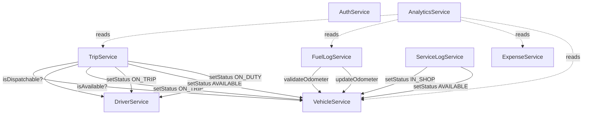

---

## 12. Phase-Wise Execution Timeline

### Hour-by-Hour Gantt Chart

```
HOUR    0         1         2         3         4         5         6
        |─────────|─────────|─────────|─────────|─────────|─────────|
DEV 1   |████ Backend Setup ████|                                    |
(API)   |         |████ Auth + Vehicle APIs ████|                    |
        |         |         |████ Trip + Finance APIs ███|           |
        |         |         |         |████ Analytics API ███|       |
        |─────────|─────────|─────────|─────────|─────────|─────────|
DEV 2   |████████ Database Schema + Prisma █████|                    |
(DB)    |         |         |████ Seed Data ████|                    |
        |         |         |         |████ Indexes + Optimization ██|
        |─────────|─────────|─────────|─────────|─────────|─────────|
DEV 3   |████ Rebrand + Sidebar + Router ███████|                    |
(UI)    |         |████ Login/Register ████|                         |
        |         |         |████ Dashboard + Vehicle Pages █████|   |
        |         |         |         |████ Trip + Maint Pages ██████|
        |─────────|─────────|─────────|─────────|─────────|─────────|
DEV 4   |████ Component Library (StatusPill, Forms) ████|            |
(UI+QA) |         |         |████ Driver + Expense Pages ████|      |
        |         |         |         |████ Analytics Page ████|     |
        |         |         |         |         |████ Polish + Demo █|
        |─────────|─────────|─────────|─────────|─────────|─────────|
```

### Milestone Checkpoints

| Checkpoint | Hour | Must Have Working |
|-----------|------|-------------------|
| **CP1** | 1:00 | Backend running, DB migrated, health endpoint responding |
| **CP2** | 2:00 | Auth (register/login), Vehicle CRUD working in Postman |
| **CP3** | 3:00 | Trip dispatch flow working, Frontend rebranded with sidebar |
| **CP4** | 4:00 | Dashboard showing live KPIs, Vehicle Registry page working |
| **CP5** | 5:00 | Full end-to-end flow: Register → Vehicle → Driver → Trip → Complete |
| **CP6** | 5:30 | Maintenance auto-status, Expense logging, Driver page |
| **DEMO** | 6:00 | All pages polished, seed data loaded, demo script ready |

---

## 13. Demo Script & Critical Path

### 13.1 Live Demo Flow (5 minutes)

```
STEP 1: LOGIN (30 sec)
├── Open FleetFlow → beautiful login page
├── Enter admin credentials → JWT issued
└── Redirect to Command Center Dashboard

STEP 2: DASHBOARD OVERVIEW (30 sec)
├── Show KPI cards (Active Fleet: 5, Maintenance: 2, Utilization: 72%)
├── Point out recent trips table
└── Show expiring license alerts

STEP 3: REGISTER A VEHICLE (45 sec)
├── Navigate to Vehicle Registry → show data table
├── Click "+ New Vehicle"
├── Fill form: Plate "MH-99-ZZ", Model "Tata Ace", Capacity: 500 kg
├── Save → toast notification → appears in table as 🟢 Available
└── Show it in the list

STEP 4: REGISTER A DRIVER (30 sec)
├── Navigate to Drivers
├── Add "Alex", License "DL-9999", Expiry: 2027
├── Toggle to ON_DUTY
└── Show green status pill

STEP 5: CREATE & DISPATCH A TRIP (60 sec) ⭐ KEY DEMO MOMENT
├── Navigate to Trip Dispatcher
├── Click "+ New Trip"
├── Show Vehicle dropdown → only AVAILABLE vehicles
├── Show Driver dropdown → only ON_DUTY + valid license
├── Enter Cargo: 450 kg → show ✅ "Within capacity"
├── ❌ DEMO THE RULE: Change cargo to 600 kg → show error "Exceeds 500 kg"
├── Fix back to 450 kg → Save as Draft
├── Click "Dispatch" → Vehicle & Driver pills turn 🔵 On Trip
└── SHOW: Vehicle dropdown on a new trip → MH-99-ZZ is GONE (assigned)

STEP 6: MAINTENANCE AUTO-STATUS (45 sec) ⭐ KEY DEMO MOMENT
├── Navigate to Maintenance
├── Create service log for another vehicle
├── Show vehicle automatically moves to 🟠 In Shop
├── Go back to Trip Dispatcher → that vehicle is NOT in dropdown
└── Close service → vehicle back to 🟢 Available

STEP 7: COMPLETE TRIP & EXPENSES (45 sec)
├── Go back to Trip Dispatcher
├── Click "Complete" on the active trip → enter distance: 285 km
├── Vehicle & Driver released → 🟢 Available / On Duty
├── Navigate to Expenses → Add fuel log (50L @ ₹96/L)
└── Show auto-calculated total: ₹4,800

STEP 8: ANALYTICS (30 sec)
├── Navigate to Analytics
├── Show updated KPIs reflecting the trip we just completed
├── Show fuel efficiency calculation
└── Show monthly financial table

TOTAL: ~5 minutes
```

### 13.2 Critical Path (What MUST Work for Demo)

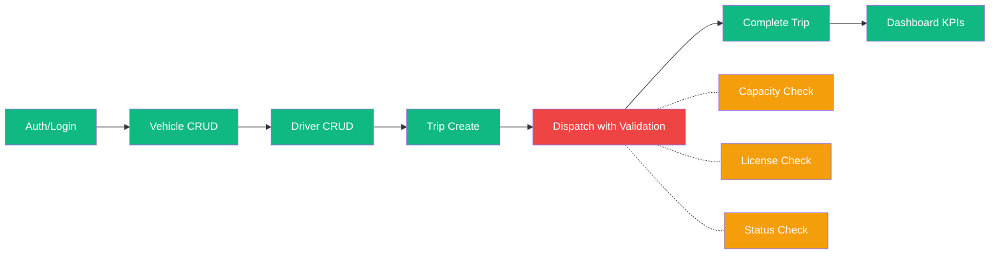

**Legend:** 🟢 Must work | 🔴 Star moment | 🟡 Validation rule to demo

---

## 14. Risk Matrix & Fallback Plans

| Risk | Probability | Impact | Mitigation | Fallback |
|------|------------|--------|------------|----------|
| Backend not ready by hour 2 | Medium | Critical | Parallel DB + API work | Frontend uses mock API data |
| Prisma migration fails | Low | High | Test migrations early | Use raw SQL via `prisma db push` |
| Docker issues | Medium | Medium | Test compose early | Run services natively (no Docker) |
| Trip dispatch logic buggy | Medium | Critical | Write transaction carefully | Simplify: skip pessimistic locks |
| Analytics page incomplete | High | Low | Lowest priority page | Show hardcoded/seed data |
| Driver Performance page incomplete | Medium | Low | Can skip for demo | Merge into simple table on Dashboard |
| Charts not working | Medium | Low | Use simple CSS bar charts | Use plain DataTable with numbers |
| Auth RBAC too complex | Medium | Medium | Start with simple JWT | Single role for demo, mention RBAC in docs |
| Team member blocked | Low | High | Clear task boundaries | Any member can pick up another's work via plan |

### What to Cut (in order of priority, lowest impact first)

1. **Cut last:** Analytics charts → replace with DataTable numbers
2. **Cut second:** CSV/PDF export → mention as "planned feature"
3. **Cut third:** Driver Performance page → merge key info into Dashboard
4. **Cut fourth:** RBAC middleware → single admin role, document roles for judges
5. **NEVER cut:** Trip dispatch with validation — this IS the product

---

## Appendix A: Status Pill Color Map (Design Token Reference)

```
VEHICLE STATUS:
  AVAILABLE  → bg-emerald-100  text-emerald-700  border-emerald-200
  ON_TRIP    → bg-blue-100     text-blue-700     border-blue-200
  IN_SHOP    → bg-amber-100    text-amber-700    border-amber-200
  RETIRED    → bg-slate-100    text-slate-500     border-slate-200

DRIVER STATUS:
  ON_DUTY    → bg-emerald-100  text-emerald-700
  ON_TRIP    → bg-blue-100     text-blue-700
  OFF_DUTY   → bg-slate-100    text-slate-500
  SUSPENDED  → bg-red-100      text-red-700

TRIP STATUS:
  DRAFT      → bg-slate-100    text-slate-600
  DISPATCHED → bg-blue-100     text-blue-700
  COMPLETED  → bg-emerald-100  text-emerald-700
  CANCELLED  → bg-red-100      text-red-600

LICENSE EXPIRY:
  > 90 days  → text-emerald-600  (safe)
  30-90 days → text-amber-600    (warning)
  < 30 days  → text-red-600      (danger)
  Expired    → text-red-700 bg-red-50 font-bold
```

## Appendix B: Zod Schema Quick Reference

```typescript
// ── Auth ──
registerSchema = z.object({
  fullName: z.string().min(2).max(100),
  email: z.string().email(),
  password: z.string().min(6).max(128),
  role: z.enum(['ADMIN', 'DISPATCHER', 'SAFETY_OFFICER', 'FINANCE']),
})

loginSchema = z.object({
  email: z.string().email(),
  password: z.string().min(1),
})

// ── Vehicle ──
createVehicleSchema = z.object({
  registrationNumber: z.string().min(1).max(20),
  make: z.string().min(1),
  model: z.string().min(1),
  year: z.number().int().min(1990).max(2030),
  capacityWeight: z.number().positive(),
  currentOdometer: z.number().nonnegative(),
})

// ── Driver ──
createDriverSchema = z.object({
  fullName: z.string().min(2).max(100),
  licenseNumber: z.string().min(1).max(30),
  licenseExpiryDate: z.string().datetime(), // ISO 8601
})

// ── Trip ──
createTripSchema = z.object({
  vehicleId: z.number().int().positive(),
  driverId: z.number().int().positive(),
  origin: z.string().min(1),
  destination: z.string().min(1),
  cargoWeight: z.number().nonnegative(),
  distanceEstimated: z.number().positive(),
})

completeTripSchema = z.object({
  distanceActual: z.number().positive(),
})

cancelTripSchema = z.object({
  reason: z.string().min(1).max(500),
})

// ── Fuel Log ──
createFuelLogSchema = z.object({
  vehicleId: z.number().int().positive(),
  tripId: z.number().int().positive().optional(),
  liters: z.number().positive(),
  costPerLiter: z.number().positive(),
  odometerAtFill: z.number().nonnegative(),
})

// ── Service Log ──
createServiceLogSchema = z.object({
  vehicleId: z.number().int().positive(),
  serviceType: z.string().min(1),
  cost: z.number().nonnegative(),
  description: z.string().optional(),
})

// ── Expense ──
createExpenseSchema = z.object({
  tripId: z.number().int().positive(),
  category: z.enum(['FUEL', 'TOLL', 'LODGING', 'MAINTENANCE_EN_ROUTE', 'MISC']),
  amount: z.number().nonnegative(),
  description: z.string().optional(),
})
```

## Appendix C: Database Seed Data (For Demo)

```
VEHICLES (5):
  1. MH-02-AB-1234 | Tata Ace    | Mini  | 500 kg   | 74,000 km  | AVAILABLE
  2. MH-04-CD-5678 | Eicher 14ft | Truck | 5,000 kg | 125,000 km | AVAILABLE
  3. MH-01-EF-9012 | Mahindra P  | Van   | 1,200 kg | 45,000 km  | IN_SHOP
  4. GJ-05-GH-3456 | Ashok Ley.  | Truck | 8,000 kg | 200,000 km | AVAILABLE
  5. MH-12-IJ-7890 | Tata LPT    | Heavy | 16,000 kg| 310,000 km | AVAILABLE

DRIVERS (4):
  1. Alex Sharma  | DL-23410 | Expiry: 2027-06-15 | ON_DUTY | Score: 89
  2. Jane Patel   | DL-56780 | Expiry: 2026-08-20 | ON_DUTY | Score: 94
  3. Sam Kumar    | DL-90120 | Expiry: 2025-12-01 | SUSPENDED (expired) | Score: 75
  4. Ravi Singh   | DL-34560 | Expiry: 2028-03-10 | OFF_DUTY | Score: 82

TRIPS (6):
  1. Vehicle #1 + Driver #1 | Mumbai → Pune    | 450 kg  | COMPLETED
  2. Vehicle #2 + Driver #2 | Delhi → Jaipur   | 3000 kg | COMPLETED
  3. Vehicle #4 + Driver #1 | Chennai → Bang.  | 6000 kg | DISPATCHED
  4. Vehicle #1 + Driver #2 | Pune → Nashik    | 300 kg  | DRAFT
  5. Vehicle #2 + Driver #1 | Jaipur → Udaipur | 4500 kg | CANCELLED (reason: client cancelled)
  6. Vehicle #5 + Driver #4 | Surat → Baroda   | 12000 kg| COMPLETED

SERVICE LOGS (2):
  1. Vehicle #3 | Brake Pad Replacement | ₹15,000 | OPEN (hence IN_SHOP)
  2. Vehicle #1 | Oil Change            | ₹3,500  | CLOSED

FUEL LOGS (4):
  1. Trip #1 | 50L @ ₹96/L = ₹4,800  | Odometer: 74,300
  2. Trip #2 | 120L @ ₹95/L = ₹11,400 | Odometer: 125,800
  3. Trip #3 | 80L @ ₹97/L = ₹7,760  | Odometer: 201,200
  4. Trip #6 | 200L @ ₹96/L = ₹19,200 | Odometer: 311,500

EXPENSES (3):
  1. Trip #1 | TOLL   | ₹500  | "Mumbai-Pune Expressway"
  2. Trip #2 | TOLL   | ₹1,200 | "NH-48 Tolls"
  3. Trip #2 | LODGING| ₹800  | "Driver overnight stay"
```

---

> **This document is the single source of truth for FleetFlow development.**
> Every team member should reference this for page specs, API contracts, validation rules, and state machine logic.
> 
> **Last Updated:** Feb 21, 2026 — Hackathon Day 🚀
