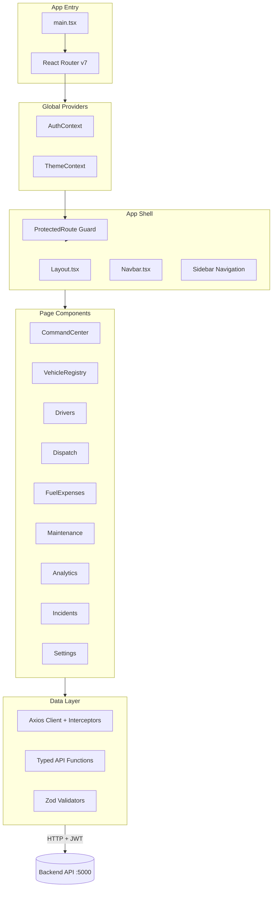
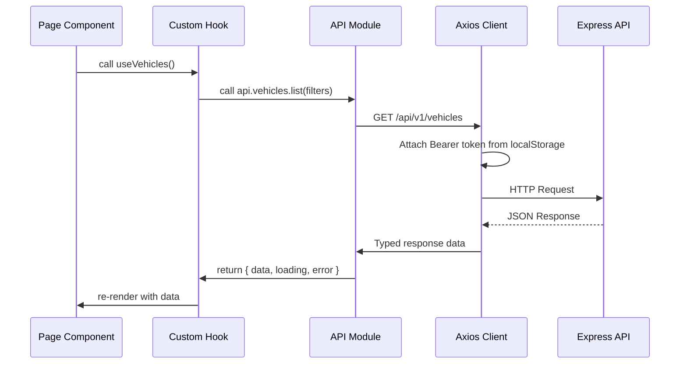
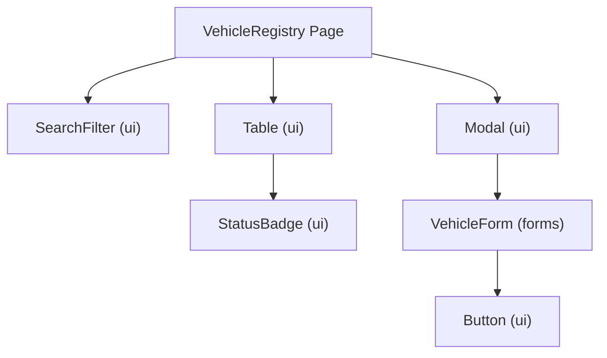
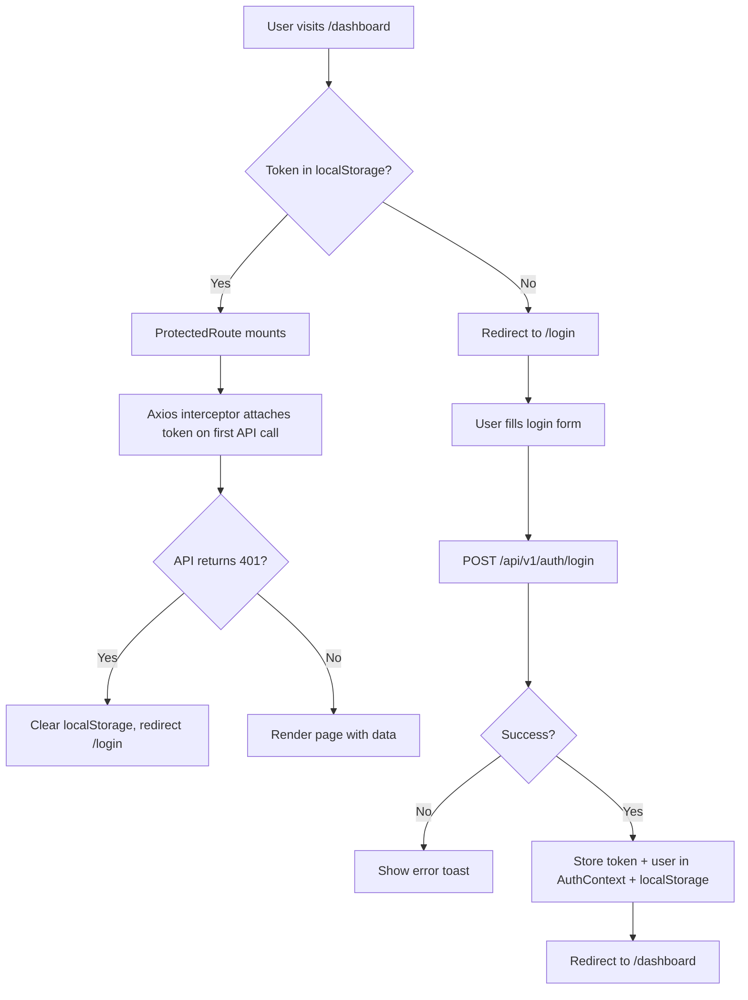

<div align="center">

# 🚛 FleetFlow — Frontend

### React 19 · TypeScript · Vite · Tailwind CSS

[](https://react.dev)
[](https://typescriptlang.org)
[](https://vitejs.dev)
[](https://tailwindcss.com)

[← Root README](../README.md) · [Backend README →](../backend/README.md) · [API Docs](http://localhost:5000/api/docs)

</div>

---

## Table of Contents

1. [Overview](#1-overview)
2. [Architecture](#2-architecture)
3. [Folder Structure](#3-folder-structure)
4. [Page & Route Inventory](#4-page--route-inventory)
5. [Component Architecture](#5-component-architecture)
6. [State Management](#6-state-management)
7. [Tech Stack](#7-tech-stack)
8. [Environment Setup](#8-environment-setup)
9. [Available Scripts](#9-available-scripts)
10. [API Integration](#10-api-integration)
11. [Styling System](#11-styling-system)
12. [Authentication Flow](#12-authentication-flow)
13. [Coding Standards](#13-coding-standards)
14. [Testing](#14-testing)

---

## 1. Overview

The FleetFlow frontend is a **React 19 Single Page Application (SPA)** that provides the complete user interface for fleet operations. It is built for performance, type safety, and a professional user experience — featuring a dark-themed command center dashboard, animated data visualizations, real-time map tracking, and PDF/CSV report export.

The application is **role-aware**: the navigation, available features, and data visibility adapt automatically based on the authenticated user's role (`MANAGER`, `DISPATCHER`, `SAFETY_OFFICER`, `FINANCE_ANALYST`).

---

## 2. Architecture

### Frontend Component Architecture



### Request Lifecycle



---

## 3. Folder Structure

```
frontend/
├── 📄 index.html               # HTML entry — sets <title>, imports main.tsx
├── 📄 vite.config.ts           # Vite config — Tailwind plugin, path aliases
├── 📄 tsconfig.app.json        # TypeScript config for app code
├── 📄 tsconfig.node.json       # TypeScript config for Vite config
├── 📄 package.json
│
└── 📁 src/
    ├── 📄 main.tsx              # React DOM root, Router provider, context providers
    ├── 📄 index.css             # Tailwind base, global custom properties
    │
    ├── 📁 api/                  # HTTP layer
    │   └── client.ts            # Axios instance + request/response interceptors
    │
    ├── 📁 components/           # Reusable UI building blocks
    │   ├── 📄 Layout.tsx        # App shell — sidebar + <Outlet> wrapper
    │   ├── 📄 Navbar.tsx        # Top bar — user menu, role badge, theme toggle
    │   ├── 📄 ProtectedRoute.tsx # Auth guard — redirects unauthenticated users
    │   ├── 📄 LoadingSpinner.tsx # Global loading indicator
    │   ├── 📁 ui/               # Primitive design system components
    │   │   ├── Badge.tsx        # Status chips (AVAILABLE, ON_TRIP, etc.)
    │   │   ├── Button.tsx       # Reusable button variants
    │   │   ├── Card.tsx         # Content container
    │   │   ├── Modal.tsx        # Dialog overlay
    │   │   ├── Table.tsx        # Sortable data table
    │   │   ├── StatCard.tsx     # KPI metric card
    │   │   ├── EmptyState.tsx   # Zero-data placeholder
    │   │   ├── Pagination.tsx   # Table pagination controls
    │   │   ├── SearchFilter.tsx # Search + filter bar
    │   │   ├── StatusBadge.tsx  # Color-coded status indicator
    │   │   └── Tooltip.tsx      # Hover tooltip
    │   ├── 📁 forms/            # Domain-specific form components
    │   │   ├── VehicleForm.tsx
    │   │   ├── DriverForm.tsx
    │   │   ├── TripForm.tsx
    │   │   ├── FuelLogForm.tsx
    │   │   ├── ExpenseForm.tsx
    │   │   ├── MaintenanceForm.tsx
    │   │   ├── IncidentForm.tsx
    │   │   └── UserForm.tsx
    │   ├── 📁 navigation/       # Sidebar and breadcrumb components
    │   ├── 📁 feedback/         # Toast notifications, error boundaries
    │   └── 📁 Branding/         # Logo component
    │
    ├── 📁 context/              # React Context providers
    │   ├── AuthContext.tsx      # User session — login, logout, token storage
    │   ├── ThemeContext.tsx     # Light/dark mode toggle + persistence
    │   └── SocketContext.tsx   # Socket.IO client connection
    │
    ├── 📁 hooks/                # Custom React hooks
    │   ├── useAuth.ts           # Consume AuthContext safely
    │   └── useSocket.ts        # Consume SocketContext
    │
    ├── 📁 layouts/              # Page layout wrappers
    │   ├── DashboardLayout.tsx  # Role-aware sidebar + content area
    │   ├── AuthLayout.tsx       # Centered auth form layout
    │   └── PrintLayout.tsx      # Print/PDF report layout
    │
    ├── 📁 pages/                # Route-level page components
    │   ├── Landing.tsx          # Public landing/marketing page
    │   ├── Login.tsx            # Login form
    │   ├── ForgotPassword.tsx   # Forgot password flow
    │   ├── ResetPassword.tsx    # Password reset with token
    │   ├── CommandCenter.tsx    # Main KPI dashboard (all roles)
    │   ├── Fleet.tsx            # Fleet overview
    │   ├── VehicleRegistry.tsx  # Vehicles CRUD table
    │   ├── Drivers.tsx          # Drivers management
    │   ├── DriverManagement.tsx # Driver detail + assignments
    │   ├── DriverPerformance.tsx # Safety score & history
    │   ├── DriverDashboard.tsx  # Driver self-service view
    │   ├── Dispatch.tsx         # Trip dispatch board
    │   ├── TripDispatcher.tsx   # Trip creation wizard
    │   ├── FuelExpenses.tsx     # Fuel log + expenses combined view
    │   ├── Expenses.tsx         # Expense management
    │   ├── Maintenance.tsx      # Maintenance log & scheduler
    │   ├── Incidents.tsx        # Incident reports
    │   ├── Analytics.tsx        # Analytics & reporting
    │   ├── FinancialReports.tsx # Finance-specific reports
    │   ├── FleetDashboard.tsx   # Fleet utilization dashboard
    │   ├── Settings.tsx         # User & system settings
    │   ├── Profile.tsx          # User profile page
    │   ├── NotFound.tsx         # 404 page
    │   ├── ComingSoon.tsx       # Placeholder for unreleased features
    │   └── 📁 dashboards/       # Role-specific dashboard views
    │
    ├── 📁 routes/               # React Router v7 configuration
    │   └── index.tsx            # Route tree — public + protected routes
    │
    └── 📁 validators/           # Zod schemas for form validation
        ├── vehicle.ts
        ├── driver.ts
        ├── trip.ts
        ├── fuelLog.ts
        └── auth.ts
```

---

## 4. Page & Route Inventory

| Route | Page | Visibility | Description |
|---|---|---|---|
| `/` | `Landing.tsx` | Public | Marketing / product landing page |
| `/login` | `Login.tsx` | Public | Authentication form |
| `/forgot-password` | `ForgotPassword.tsx` | Public | Password reset request |
| `/reset-password` | `ResetPassword.tsx` | Public | Password reset with token |
| `/dashboard` | `CommandCenter.tsx` | All Roles | KPI command center |
| `/fleet` | `Fleet.tsx` | All | Fleet overview |
| `/vehicles` | `VehicleRegistry.tsx` | All | Vehicle CRUD table |
| `/drivers` | `Drivers.tsx` | All | Driver management |
| `/trips` | `Dispatch.tsx` | All | Trip dispatch board |
| `/trips/new` | `TripDispatcher.tsx` | Manager, Dispatcher | Trip creation form |
| `/fuel` | `FuelExpenses.tsx` | All | Fuel & expense logs |
| `/expenses` | `Expenses.tsx` | Manager, Finance | Expense management |
| `/maintenance` | `Maintenance.tsx` | Manager, Safety | Service log & scheduler |
| `/incidents` | `Incidents.tsx` | All | Incident reports |
| `/analytics` | `Analytics.tsx` | Manager, Finance | Full analytics suite |
| `/reports/finance` | `FinancialReports.tsx` | Manager, Finance | Financial reporting |
| `/reports/fleet` | `FleetDashboard.tsx` | Manager | Fleet utilization |
| `/settings` | `Settings.tsx` | Manager | System settings |
| `/profile` | `Profile.tsx` | All | User profile |
| `*` | `NotFound.tsx` | All | 404 fallback |

---

## 5. Component Architecture

### Design Philosophy

Components follow a **three-tier hierarchy**:

```
Pages (route-level, data-fetching)
  └── Feature Components (domain logic, forms)
        └── UI Primitives (stateless, reusable)
```

**Rules:**
- Pages are responsible for data fetching and state. They pass data down as props.
- Feature components (forms, tables) contain domain-specific logic.
- UI primitives (`Button`, `Badge`, `Card`) are fully stateless and styled via props.

### Component Diagram



---

## 6. State Management

FleetFlow uses **React Context + local component state** — no Redux or Zustand — keeping the state management minimal and co-located.

| State | Location | Scope |
|---|---|---|
| Auth session (user, token) | `AuthContext` | Global |
| Theme (light/dark) | `ThemeContext` | Global |
| Socket connection | `SocketContext` | Global |
| Page data (vehicles, trips, etc.) | Component `useState` | Local to page |
| Form state | Controlled inputs + Zod | Local to form |
| UI state (modal open, filters) | Component `useState` | Local |

### AuthContext

```typescript
interface AuthContextValue {
  user: AuthUser | null;
  token: string | null;
  login: (email: string, password: string) => Promise<void>;
  logout: () => void;
  isAuthenticated: boolean;
}
```

The token is persisted in `localStorage` and auto-attached to all Axios requests via an interceptor.

---

## 7. Tech Stack

| Technology | Version | Role in System |
|---|---|---|
| **React** | 19 | Component rendering, concurrent features |
| **TypeScript** | 5.x | End-to-end type safety |
| **Vite** | 7.x | Dev server (HMR), production bundler |
| **Tailwind CSS** | 4.x | Utility-first styling system |
| **React Router DOM** | 7.x | Client-side routing + nested layouts |
| **Axios** | 1.x | HTTP client with interceptors |
| **Recharts** | 3.x | Data visualization (line, bar, pie, area charts) |
| **Leaflet + react-leaflet** | 1.x / 5.x | Interactive GPS maps |
| **Framer Motion** | 12.x | Page transitions and micro-animations |
| **Zod** | 4.x | Form validation + TypeScript inference |
| **jsPDF + html2canvas** | — | Client-side PDF report generation |
| **Lucide React** | 0.575 | Icon library (1500+ icons) |
| **Socket.IO Client** | 4.x | Real-time event subscription |

---

## 8. Environment Setup

### Prerequisites

| Tool | Version |
|---|---|
| Node.js | ≥ 20 LTS |
| npm | ≥ 10 |

### Installation

```bash
cd frontend
npm install
```

### Environment Variables

Create `frontend/.env` (or set in root `.env` and Vite will pick it up):

```env
VITE_API_BASE_URL=http://localhost:5000
```

> All Vite env vars must be prefixed with `VITE_` to be accessible in browser code.

---

## 9. Available Scripts

| Script | Command | Description |
|---|---|---|
| **Dev server** | `npm run dev` | Start Vite with HMR on `:5173` |
| **Production build** | `npm run build` | Type-check + bundle to `dist/` |
| **Preview build** | `npm run preview` | Serve `dist/` locally |
| **Lint** | `npm run lint` | Run ESLint on all source files |

### Development

```bash
npm run dev
# App available at http://localhost:5173
```

### Production Build

```bash
npm run build
# Output: dist/
# Serve with: npm run preview  OR  nginx / Vercel / Netlify
```

---

## 10. API Integration

### Axios Client

The Axios instance (`src/api/client.ts`) is pre-configured with:
- **Base URL**: `VITE_API_BASE_URL` env var
- **Request interceptor**: Attaches `Authorization: Bearer <token>` from `localStorage`
- **Response interceptor**: On `401` response, clears session and redirects to `/login`

```typescript
// Example usage in a page
import { vehiclesApi } from '@/api/vehicles';

const { data } = await vehiclesApi.list({ status: 'AVAILABLE' });
```

### API Module Conventions

Each module in `src/api/` exports strongly-typed functions:

```typescript
// src/api/vehicles.ts
export const vehiclesApi = {
  list: (params?: VehicleListParams) =>
    client.get<ApiResponse<Vehicle[]>>('/vehicles', { params }),
  
  create: (body: CreateVehicleInput) =>
    client.post<ApiResponse<Vehicle>>('/vehicles', body),
  
  updateStatus: (id: string, status: VehicleStatus) =>
    client.patch<ApiResponse<Vehicle>>(`/vehicles/${id}/status`, { status }),
};
```

---

## 11. Styling System

### Design Tokens

The global design system is defined in `src/index.css` using CSS custom properties:

```css
:root {
  --color-primary: #6366f1;      /* Indigo — primary brand color */
  --color-surface: #1e1e2e;      /* Dark surface */
  --color-surface-2: #252535;    /* Elevated surface */
  --color-text: #e2e8f0;         /* Primary text */
  --color-text-muted: #94a3b8;   /* Secondary text */
  --color-border: #2e2e45;       /* Subtle border */
  --radius-md: 0.5rem;
  --shadow-lg: 0 8px 32px rgba(0,0,0,0.4);
}
```

### Status Color Conventions

| Status | Color | Used For |
|---|---|---|
| `AVAILABLE` / `COMPLETED` / `ON_DUTY` | `green` | Positive / ready states |
| `ON_TRIP` / `DISPATCHED` | `blue` | Active / in-progress states |
| `IN_SHOP` / `DRAFT` | `yellow/amber` | Neutral / pending states |
| `RETIRED` / `CANCELLED` / `SUSPENDED` | `red` | Terminal / blocked states |

---

## 12. Authentication Flow



### Role Guard

The `ProtectedRoute` component also accepts an optional `allowedRoles` prop:

```typescript
<ProtectedRoute allowedRoles={['MANAGER', 'FINANCE_ANALYST']}>
  <FinancialReports />
</ProtectedRoute>
```

Users without the required role see a `403` page.

---

## 13. Coding Standards

### File Naming

| Type | Convention | Example |
|---|---|---|
| Components | `PascalCase.tsx` | `VehicleForm.tsx` |
| Hooks | `camelCase.ts` | `useAuth.ts` |
| API modules | `camelCase.ts` | `client.ts` |
| Validators | `camelCase.ts` | `vehicle.ts` |
| CSS | `kebab-case.css` | `index.css` |

### Component Structure

```typescript
// 1. Imports
import React, { useState } from 'react';

// 2. Type definitions
interface Props {
  vehicleId: string;
  onSuccess?: () => void;
}

// 3. Component (named export preferred)
export function VehicleForm({ vehicleId, onSuccess }: Props) {
  // 4. Hooks at the top
  const [loading, setLoading] = useState(false);

  // 5. Event handlers
  async function handleSubmit() { ... }

  // 6. Render
  return ( ... );
}
```

### Import Alias

Use `@/` to reference `src/`:
```typescript
import { Button } from '@/components/ui/Button';
import { vehiclesApi } from '@/api/vehicles';
```
Configure in `vite.config.ts` and `tsconfig.app.json`.

---

## 14. Testing

### Unit Tests (Vitest)

```bash
npm run test
# Watch mode: npm run test -- --watch
```

Test files are co-located with the source:
```
src/validators/vehicle.test.ts
src/hooks/useAuth.test.ts
```

### Component Tests (React Testing Library)

```typescript
import { render, screen } from '@testing-library/react';
import { StatusBadge } from '@/components/ui/StatusBadge';

test('renders AVAILABLE badge in green', () => {
  render(<StatusBadge status="AVAILABLE" />);
  expect(screen.getByText('AVAILABLE')).toHaveClass('text-green-400');
});
```

### Coverage Target

```bash
npm run test -- --coverage
# Target: ≥ 60% statement coverage
```
